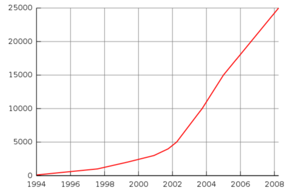
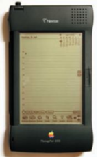
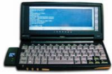
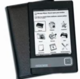
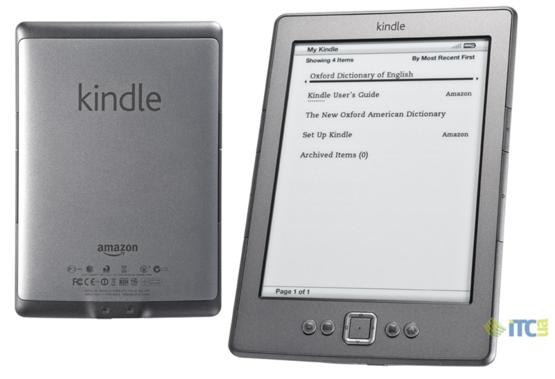
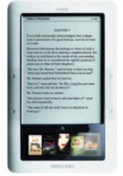
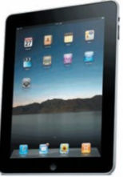
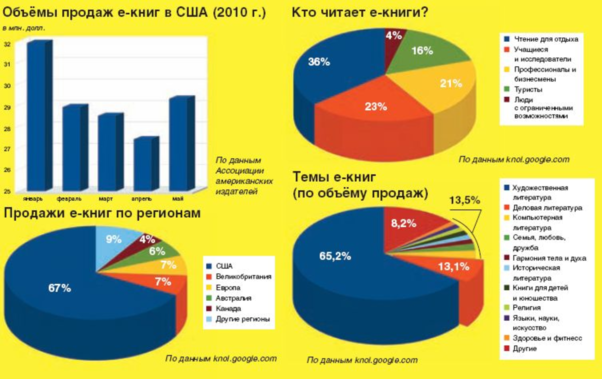
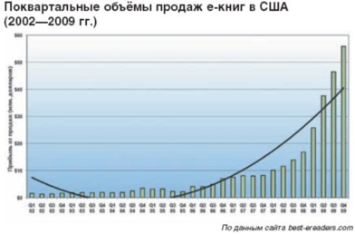

Введение 
--------

### Что?

Чтение уже много веков является наиболее эффективным способом передачи
информации. Электронное чтение является шагом вперед, позволяя всегда
иметь под рукой домашнюю библиотечку.

### Где?

- На компьютере, планшете, читалке и телефоне 
- В браузере на любых устройствах
- В браузере на любых устройствах 
- В специальных программах для чтения iBooks, Kindle
- На электронных читалках kindle4 и аналогах

### Когда?

За 2012 году Amazon продал электронных книг больше, чем напечатанных на
бумаге. Читать с экрана сегодня модно, это веяние времени.

 

### А главное -- почему?

- компактность и портативность 0
- в одном устройстве могут храниться сотни и тысячи книг; q 
- доступность -- быстрое получение при наличии интернета; q
- возможность полнотекстового поиска; q q
- возможность быстрого и простого изменения шрифта;  q
- возможность прослушать текст книги; q
- возможность чтения книг при низком уровне освещенности; q
- низкая стоимость распространения;
- меньшее время на издание по сравнению с бумажными книгами;
- экологичность — не расходуется древесина деревьев;

### Недостатки тоже имеются

Отсутствие эстетической составляющей?

скажите это владельцу новенького iPad.

Экраны некоторых устройств быстро переутомляют глаза.

существуют устройства с превосходным экраном.

Электронные устройства рассеивают внимание?

да вы просто недостаточно увлечены.

Время работы переносного устройства ограничено емкостью батареи?

если 2 месяца в Amazon Kindle 4 мало есть внешние аккумуляторы.

Электронная бумага требует качественного освещения?

есть решение -- Kindle Paperwhite.

### Результат

Многие из нас скачивают книги из различных интернет-библиотек и
сохраняют у себя на тех или иных носителях информации. И однажды
наступает момент, когда необходимо упорядочить скачанное. Хорошо, если
скачано несколько десятков или сотен книг – их можно разложить руками в
файл-менеджере, но когда счет скачанных книг идет на тысячи не обойтись
без личной библиотеки.

Е-книги проще покупать: несколько щелчков мышкой или нажатий на дисплей
портативного устройства — и можно начинать читать. Их легче хранить — не
нужно шкафов и полок, а обычная флешка вместит несколько тысяч томов.
Они дешевле; в отличие от бумажных, экологичны и не губят деревья.

История книжного дела
---

\*текст по мотивам
[http://www.publish.ru/articles/201010\_15518698](http://www.publish.ru/articles/201010_15518698)

автор Александр Шнайдер, директор «Типографии Арес».

Майкл Харт

 

История электронных книг началась в далёком 1971 г. Тогда не
существовало ни интернета, ни персональных компьютеров, а мобильные
телефоны были размером с чемодан. Но большие ЭВМ уже были, и к одной
удалось получить практически неограниченный доступ студенту Иллинойского
университета Майклу Харту. Он верил, что в недалёком будущем компьютеры
будут доступны каждому, и решил совершить что-то полезное. Юноша задался
целью перевести в электронный формат 10 тысяч наиболее известных
произведений мировой литературы, причём уложиться до конца века.

 

 

Количество в книг, оцифрованных в рамках проекта «Гутенберг»

Первым электронным текстом стала американская «Декларация
независимости», которую Харт носил в рюкзаке. Студент назвал свою
инициативу «Проект Гутенберг» в честь знаменитого первопечатника.

Постепенно проект расширялся, к нему присоединялись другие участники. До
1989 г. все тексты набирались вручную. Затем стали использоваться
сканеры и программы распознавания текстов. «Проект Гутенберг» существует
и по сей день в виде некоммерческой организации. На конец прошлого года
в его библиотеке было более 32 тысяч е-книг. План давно перевыполнен.

 

Максим Мошков -- Unix system administrator и создатель lib.ru.

 

В нашей стране тоже появился подобный энтузиаст. Правда, гораздо позже:
в 1994 г. программист Максим Мошков создал интернет-библиотеку lib.ru.
Она пополняется, главным образом, усилиями пользователей. Цифра в 30
тысяч книг, по данным Мошкова, была превышена ещё в 2006 г. Библиотека
продолжает расти и сохраняет популярность, несмотря на то (а может быть,
даже благодаря тому), что её дизайн не менялся с первого дня
существования — таково решение её владельца.

Сегодня в интернете тысячи онлайн-библиотек, платных и бесплатных,
предоставляющих книги в разных форматах и на разные темы. В
русскоязычной книжной поисковой системе eBdb.ru — более 1,5 миллионов
проиндексированных файлов. Для сравнения: Российская государственная
библиотека имеет около 40 миллионов единиц хранения. Есть над чем
работать…

 

### Apple Newton: первая попытка создания КПК

Конечно, можно читать с экрана компьютера, но это, прямо скажем, не
слишком комфортно. Гораздо удобнее некое портативное устройство, которое
легко взять с собой.

Пионерами здесь стали разработчики Apple. В 1993 г. они выпустили на
рынок совершенно новый тип компьютера — «персональный цифровой помощник»
(Personal Digital Assistant, PDA). Это ещё не карманный компьютер (КПК)
— для такой аттестации первый PDA был великоват. Но это был
действительно портативный компьютер с собственной операционной системой,
набором приложений и рукописным вводом. Сначала его назвали MessagePad,
а ОС — Newton, позже и само устройство стали величать Newton. Оно имело
собственный формат файлов е-книг и было снабжено программой для их
чтения. Наверное, это было первое мобильное устройство для чтения книг в
цифровом формате — и это 17 лет назад!

Apple Newton не получил широкого распространения и не стал коммерчески
успешным продуктом. Во многом из-за непомерной цены (почти 1000 долл.),
но основная причина в другом — Apple просто опередила своё время, хотя и
ненамного.

### Palm OS против Windows CE, PalmPilot против HPC/PPC

В 1996 г. Palm выпустила абсолютно новое портативное устройство  —
карманный компьютер (КПК) Palm. Оно кардинально отличалось от Newton:
маленькое, лёгкое и сравнительно дешёвое. Для него создали специальную
операционную систему Palm OS. Девайс быстро завоевал популярность.
PalmPilot получил собственный формат файлов е-книг (PDB), под него было
выпущено несколько программ для чтения.

Успех Palm не остался незамеченным софтверным гигантом Microsoft. В
конце 1996 г. была выпущена операционная система Windows CE (WinCE),
специально для портативных компьютеров. Различные производители (Casio,
Philips, Hewlett-Packard, Compaq, Sharp и другие) тут же начали
разработку и выпуск «ручных» (hand-held PC, HPC) компьютеров и
«наладонных» (palm-size PC, PPC), отличавшихся меньшим размером и
отсутствием клавиатуры. Именно «наладонники» стали первым классом
устройств, действительно широко используемых для чтения е-книг.

### LIT, Mobipocket и FB2: форматы размножаются почкованием

Первые е-книги имели самый простой и примитивный формат TXT, не
предполагающий никакого стилевого оформления текста. Но с появлением
устройств для их чтения людям захотелось большего: оглавления и ссылок,
выделения заголовков и цитат… Появился запрос на более сложные форматы
файлов, разработанные непосредственно для цифровых книг.

Microsoft была первой компанией, попытавшейся сделать из формата е-книг
коммерческий инструмент. В 2000 г. она предложила формат файлов LIT и
встроила в очередную версию Windows CE (к тому времени она стала
называться PocketPC) программу для их чтения Microsoft Reader. Книги в
формате LIT в этой программе смотрятся очень даже неплохо: это первый
формат, поддерживающий сглаживание шрифтов ClearType.

Формат LIT является защищённым: открывать е-книги можно только в
активированной версии программы. Это позволяет Microsoft ограничивать
использование файлов и самой программы Microsoft Reader.

Другим популярным форматом стал PRC. Его (тоже в 2000 г.) разработала
французская Mobipocket, создав и программу для чтения — Mobipocket
Reader. Формат получил широкое распространение ещё и потому, что
компания предложила (в т. ч. бесплатно) приложение для создания и
форматирования в нём е-книг. Позже Mobipocket была куплена Amazon, и
теперь на платформе PRC основан формат файлов Kindle (см. далее).

Российские специалисты тоже внесли вклад в многообразие форматов
электронных книг. Автор чрезвычайно удачной программы чтения HaaliReader
Михаил Мацнев в содружестве с Дмитрием Грибовым разработал новый формат
— FictionBook (FB2). В нём книга представляется в виде XML-документа, и
каждый её элемент оформляется своими тегами. FB2 очень популярен в
Рунете, и большинство русскоязычных электронных библиотек предоставляют
е-книги в этом формате.

 

### «Электронная бумага»

Рынок е-ридеров (специализированных устройств для чтения е-книг)
развивался крайне вяло до 2007 г., когда новые модели от разных
производителей начали появляться одна за другой. Причина —
в промышленной реализации дисплеев, основанных на технологии
«электронной бумаги» (e-paper). Другое её название — «электронные
чёрнила» (e-ink).

Сама «электронная бумага» была разработана ещё в 1970-х специалистами
исследовательской лаборатории корпорации Xerox. В отличие от обычных
экранов, эти дисплеи не светятся — они показывают изображение в
отражённом свете, а значит, от них меньше устают глаза. Кроме того, они
потребляют энергию только в момент смены изображения, поэтому имеют
существенно меньшую энергоёмкость. Их основной недостаток — очень
большое время обновления по сравнению с ЖК-мониторами. Поэтому их можно
использовать, только когда нет необходимости показывать быстро
меняющееся изображение. Другими словами, в устройствах для чтения
электронных книг.

В 2007 г. появился первый е-ридер на основе этой технологии — Sony
Reader PRS-500. С того момента выпущено множество устройств от различных
производителей. Они различаются размером дисплея, количеством
отображаемых градаций серого («электронная бумага» пока способна
показывать только монохромное изображение), функциями и встроенными
приложениями. Некоторые модели (например, Sony Reader PRS-700) имеют
сенсорный экран.

### В игру вступают тяжеловесы

19 ноября 2007 г. — знаменательный день в истории е-книг: крупнейший
интернет-магазин планеты Amazon представил миру новый товар… Kindle един
в трёх лицах: это устройство для чтения е-книг, формат файлов, который
оно читает, и онлайн-магазин е-книг, с которым оно связывается через
интернет, чтобы скачивать файлы.

Kindle, без преувеличения, перевернул рынок е-книг. Раньше это был
узконишевой товар, интересующий только энтузиастов цифрового чтения и не
оказывающий существенного влияния на книгоиздательскую индустрию. Amazon
сделал е-книги доступными всем. Теперь, чтобы их читать, не нужно быть
специалистом-компьютерщиком. Достаточно приобрести устройство, зайти
через него в онлайн-магазин, ввести данные кредитной карты — и уже через
несколько секунд нужная книга окажется у вас в Kindle.

Сейчас Amazon предлагает две версии е-ридера: Kindle и Kindle DX.
Последний имеет большой 10-дюймовый экран и позволяет читать не только
книги, но и газеты с журналами. Amazon также выпустил версии программы
для чтения книг Kindle для PC, Mac и iPhone/iPad. В начале августа
Amazon представил новое поколение своего устройства — Kindle 3. Ридер
стал меньше и легче, а цвет корпуса изменился на модно графитовый. Спрос
оказался таким, что первая партия была распродана немедленно; новые
поставки ожидаются не раньше середины сентября.

Другие гиганты книжного ритейла отставать не хотят. Осенью 2009 г.
крупнейшая книготорговая сеть США Barnes & Noble стала продавать
собственный е-ридер Nook. Он читает различные форматы е-книг и снабжён
двумя экранами (цветной — для удобства навигации по интернет-магазину
Nook). А недавно вторая по величине американская сеть книжных магазинов
Borders открыла свой интернет-магазин е-книг и начала продвигать ридер
Kobo.

### iPad подкрался незаметно

Появление Apple iPad 1 апреля 2010 г. произвело революцию в области
цифровых устройств вообще и е-книг в частности. Хотя в самом iPad, по
сути, нет ничего революционного (планшетные компьютеры с сенсорными
экранами существуют уже много лет), он буквально взорвал рынок е-книг. К
середине июля было продано более 3,3 млн устройств.

Если Amazon своим Kindle сделал чтение е-книг простым и доступным
каждому занятием, то Apple показал всем, что это увлекательно, модно и
«круто». Неудивительно, что, по утверждению Стива Джобса, к середине
июня 2010 г. 22% мировых продаж электронных книг приходилось именно на
iPad.

Большой цветной дисплей даёт возможность читать с экрана не только
книги, но журналы и газеты. В цифровое издание можно интегрировать все
виды мультимедийного контента, например, видео.

 

### Будущее е-книг

Ценовая война между гигантами книжного рынка привела к тому, что цены на
ридеры существенно упали. В лидеры вышла сеть Borders, которая
предлагает устройство по цене 119 долл. Barnes & Noble ответил снижением
цены на Nook до 149, Amazon свой новый Kindle 3 продаёт за 139.

Стремительная «коммодитизация» рынка устройств для чтения неизбежно
приведёт к смене бизнес-модели крупных торговцев е-книгами. Поскольку
прибыль от продажи ридеров становится минимальной, они не смогут
удерживать цены на е-книги на сегодняшнем низком уровне. Некоторые
издательства уже заключили с Amazon соглашения, по которым именно они, а
не ритейлер, определяют цены на свои е-книги. Впрочем, повышение цен
вряд ли будет большим, и е-книги всё равно останутся более
привлекательными экономически, нежели бумажные.

Примечательно, что ценовая война обошла стороной iPad. Потому многие
эксперты предрекают скорое исчезновение устройств на основе «электронной
бумаги», в результате чего все ридеры станут «планшетоподобными».

Всё новые и новые игроки объявляют о намерении выйти на этот рынок.
Toshiba готовится к запуску собственного онлайн-магазина BookPlace. И
даже гигант интернет-поиска Google запускает проект Google Editions и
тоже собирается торговать е-книгами.

Явно назрела необходимость появления единого открытого формата файлов
е-книг, который будут читать все ридеры. Люди недовольны тем, что каждый
производитель стремится создать и максимально защитить собственный
формат. Возможно, единым форматом станет Google Editions.

Крупные книгопродавцы, скорее всего, уйдут с рынка устройств для чтения,
сосредоточившись на е-книгах. В частности, ожидается, что Amazon уже к
2012 г. откажется от продажи Kindle.

В ближайшее время ожидается появление множества iPad-подобных устройств,
построенных на платформах Windows 7 или Android. Многие наверняка в
чём-то превосходят iPad, некоторые дешевле. Возможно, это станет концом
для монохромных книг на базе «электронной бумаги». А распространение
планшетников может привести к тому, что е-книги станут максимально
приближены к печатным по внешнему виду и стилевому оформлению, —
разрешение планшетных устройств позволяет это сделать.

Вполне вероятно, что в ближайшее время и на отечественном рынке е-книг
настанет пора серьёзных игроков. Почти наверняка ими станут сотовые
операторы «большой тройки». Тогда и разнообразие ридеров увеличится, и
цены на них упадут…

### Е-книги: бизнес-модель

Классическая ценовая стратегия для инновационных продуктов заключается в
следующем. На начальном этапе цена новинки, нацеленной на узкий сегмент
рынка, высока. Это метод маркетингового исследования, с помощью которого
производители определяют перспективы продукта. Если спрос недостаточен —
конкуренция в нише не возникает, нет рыночных оснований для снижения
цены и продукт в конце концов исчезает с рынка (как и произошло с Apple
Newton). Если же спрос есть, на рынок выходят новые производители с
более совершенными моделями, ниша расширяется и, стремясь занять
максимальную её часть, игроки рынка снижают цены.

Именно это произошло летом 2010 г. на рынке е-ридеров. Основные игроки —
Amazon, Barnes & Noble и недавно появившаяся в этом сегменте ритейловая
сеть Borders — затеяли «ценовую войну», существенно снизив на них цены.
Это резко изменило ситуацию на рынке, переведя е-книги из «нишевого»
продукта в самый что ни на есть «мейнстрим». Издатели больше не могут
игнорировать цифровой формат или искусственно «удерживать» его развитие,
стремясь не допустить конкуренции с основным своим товаром — печатными
книгами. Продолжившие держаться за «бумагу» в ущерб «цифре» рискуют
оказаться на обочине рынка.

Нечто подобное происходило несколько лет назад в музыкальной индустрии.
Создав iPod и онлайн-магазин iTunes Store, Apple, по сути, уничтожил
гигантский рынок розничной торговли музыкальными альбомами. Когда есть
iPod, CD-диски не нужны…

Но новая ценовая модель музыкальной индустрии совсем не такая, как в
е-книгах. В первом случае доходы поступают, главным образом, от продажи
электронных устройств, а контент отдаётся почти без прибыли. При ценах в
99 центов за песню много не заработаешь. В издательской индустрии зреет
противоположная модель. Продажа устройств перестаёт приносить прибыль, и
основной доход должен будет поступать от торговли е-книгами.

И здесь скрывается серьёзная проблема, решить которую издатели пока не
могут. Структура их расходов такова, что создание е-книги стоит
ненамного дешевле, чем производство бумажной, — собственно печать и
логистика часто занимают относительно скромную долю в общих затратах. А
потребитель ожидает, что е-книги будут существенно дешевле печатных, —
иначе зачем ему было вкладывать деньги в устройство для чтения?

Многие издатели уже протестуют против политики Amazon, которая
устанавливает на большинство е-книг цену ниже 10 долл.: дескать, это
лишает их доходов и способно вообще погубить отрасль. Некоторые
издательские дома уже договорились с Amazon, что цены будут
устанавливать именно они, причём существенно выше десятидолларового
ориентира.

Каков выход? Во-первых, повышение ценности е-книги в глазах читателей.
Уже идут разговоры о том, что она будет включать в себя
аудио/видеоконтент, станет более интерактивной. Правда, тогда
iPad-подобные устройства окончательно вытеснят с рынка ридеры на основе
«электронной бумаги». Некоторые эксперты возлагают надежду на продажу
комплектов («bundles»), когда е-книга продаётся совместно с бумажной
(например, в виде ссылки на обложке, по которой можно скачать
электронную версию). А кто-то полагает, что проблема решится сама собой:
продажи бумажных книг упадут настолько, что издатели будут вынуждены
поднять на них цены, и соотношение стоимости электронных и печатных книг
восстановится.

изучение статистики
-------------------

После подробного изучения мы остановили выбор...

14 млн ридеров, по прогнозам аналитиков, будет продано по всему миру в
2013 году.

630 тысяч платных и 1,8 млн бесплатных электронных книг предлагает своим
покупателям крупнейший американский онлайн-магазин Amazon.

143 электронные книги приходятся на каждые 100 проданных в Америке
бумажных книг в твердой обложке.

В 140 стран мира поставляются электронные книги сегодня.

750 млн евро выделил на оцифровку библиотек, музыкальных и киноархивов и
других хранилищ президент Франции Никола Саркози, взяв курс на
ликвидацию электронно-культурного отставания нации.

На 40-70 долларов (30%) снизилась стоимость электронных книг от
популярных производителей Barnes & Noble и Amazon за последние два
месяца.

20% европейских читателей в прошлом году прекратили покупать бумажные
книги, переключившись на чтение электронных изданий.

На 176% выросли продажи электронных книг в мире в прошлом году и
достигли 313 млн долларов.

Ebook sales grew 177% last year.

53% of those who buy eBook readers state that they now read more books
than they did before. (This is a good thing, right?)

51% of eReader owners increased their purchases of eBooks in the past
year.

176% Increase in US electronic-book sales in 2009.

86% of eReader owners read on their device more than once a week.

51% of eReader owners read on their device on a daily basis. (Wow!)

eReaders are now owned by 1 in 10 Americans. 12% of Americans plan to
buy one within 6 months.

The average Amazon customer buys 3.3x as many books after buying a
Kindle than before they had one.

One out of five people who buy digital books from the Kindle store don’t
own a Kindle device. (i.e., 20% of sales are on iPads, etc.)

iPad controls 16% of the eReader market and rising.

iPad sales are expected to be 15.6 million this year and 46 million next
year.

Interesting demographics here:

iPad users: 65% male, 63% under 35, 39% make more than \$80k.

Kindle users: 52% male, 47% under 35, 44% make more than \$80k.

44% prefer Kindle on the iPad over the iBookstore.

вывод (переделать)
------------------

Подведем итоги проведенным исследованиям.

Из исследования истории ясно, что нет смысла пытаться создать
универсальный продукт, поскольку он, скорее всего, не сможет окупиться.
Также стоит учесть, что имеет смысл снабжать навигаторы тем, что
позволит им нормально функционировать в среде, для которой они
предназначены. Вероятно, в нашем случае это будет жаростойкость.

Интрефейсы эволюционируют в направлении большей и большей просты и
понятности, это значит, что нам предстоит разработать простые,
интуитивно понятные элементы управления, причем такой цветовой гаммы,
чтобы, с одной стороны, интерфейс выглядел стильно, а с другой – было
хорошо виден в багровом свете Ада.

Кое-какие из известных функций нам могут пригодиться: например,
возможность выхода в интернет, интеграция с другими устройствами,
справки о местных

достопримечательностях, однако, стоит быть осторожными при добавлении
различных функций в путеводитель по Аду: функции караоке или
видео-проигрывателя могут оказаться потенциально опасными в данной
обстановке. Этот вопрос требует более детального рассмотрения при
проектировании интерфейса.

Область применения нашего навигатора на данный момент лишает нас
конкуренции, поэтому интерфейс может не содержать в своей первой версии
революционных инноваций, достаточно будет грамотно использовать
имеющиеся идеи, сделать интерфейс достаточно дружелюбным, удобным и
понятным. Однако, специфика области применения навигатора может
потребовать наличия в навигаторе функций, которые не имеют смысла во
всех прочих навигаторах: например, функцию определения температуры лавы
или локатор расчета глубины расщелины в грунте. Это, как и уникальная
область применения, позволит резко выделиться на фоне прочих
конкурентов.

С учетом нынешних рыночных тенденций, не стоит делать ставку только на
навигаторы – возможно, следует параллельно выпускать мобильные варианты
навигатора, однако, подобные программы потребуются, когда мобильные
устройства станут приспособленными к условиям Ада, так что в первую
очередь следует сконцентрироваться на навигаторах.

Calibre это свободное кроссплатформенное приложение с открытым исходным
кодом разработанное для пользователей электронных книг с большим
количеством возможностей.

•Управление библиотекой.\
Calibre предоставляет возможность управление вашей коллекцией книг.
Концепция программы — множество одинаковых книг в разных форматах
представлены как одна книга в библиотеке.\
Можно сортировать и искать книги по метаданным таким как: название,
автор, дата издания, дата добавления, размер, серия книг, рейтинг итп.
Также есть поддержка тегов и комментариев и обзоров.\
Вы легко можете найти требуемую книгу при помощи простого поиска или
используйте расширенный поиск.\
Добавляемые вами книги программа организует в четкую иерархическую
структуру папок на вашем жестком диске, так что даже в отсутствие
программы вы сможет разобраться в вашей библиотеке.\
Плюс calibre может искать метаданные о книгах и обложки в интернете по
названию/автору или ISBN. Система поиска метаданных определяется
плагинами и легко может быть расширена самостоятельно (С литературой на
английском ищет на ура)

•Конвертер книг\
Calibre поддерживает конвертирование из кучи форматов в кучу других.\
Input Formats: CBZ, CBR, CBC, EPUB, FB2, HTML, LIT, LRF, MOBI, ODT, PDF,
PRC\*\*, PDB, PML, RB, RTF, TCR, TXT\
Output Formats: EPUB, FB2, OEB, LIT, LRF, MOBI, PDB, PML, RB, PDF, TCR,
TXT\
Конвертирование обладает множеством опции, таких как изменение размера
шрифта, создание структуры книги и сносок итп.

•Синхронизация с ридерами\
Calibre использует модульную систему драйверов для ридеров, которая
позволяет добавлять новые устройства. Сейчас программа поддерживает уже
множество устройств. При синхронизации Calibre сама выбирает наиболее
подходящий формат или если нет нужного — конвертирует в требуемый. Также
добавляет в ридер все нужные метаданные и информацию о сериях книг.

•Скачивание новостей и конвертация их в книгу\
Calibre содержит уже 3 сотни источников новостей. И прочитав мануал, вам
не составит труда добавить новые источники

•Встроенная читалка для книг\
Calibre содержит встроенные программы для чтения всех поддерживаемых
форматов книг.

•Веб-сервер контента\
Calibre содержит встроенный веб-сервер для удаленного управления
библиотекой. Также она может скачивать и высылать книги вам по
электронной почте

 