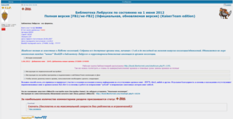
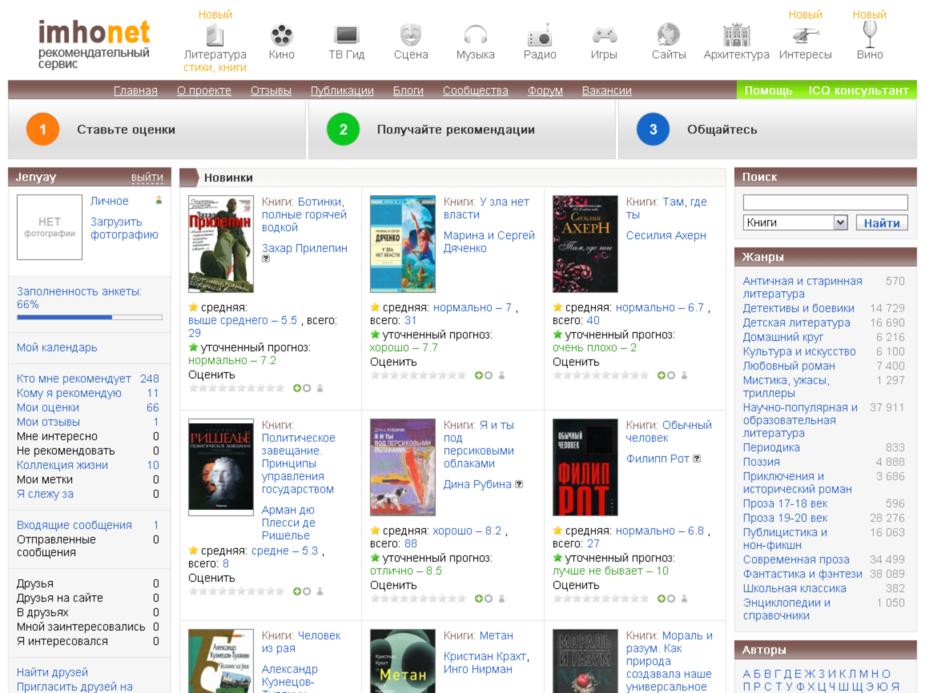
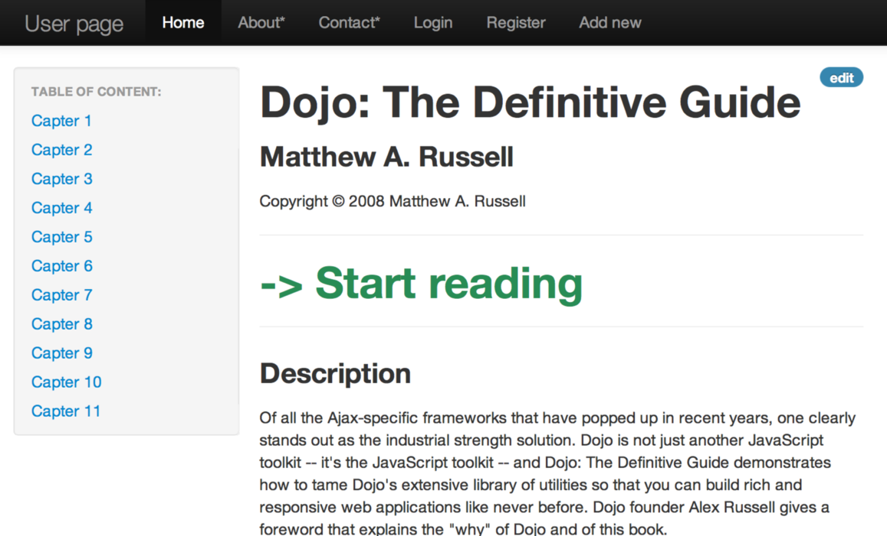



[lab2\_concurents](../../rvoYD_.html)
=====================================

Oleg Baskakov

[previous page](cover.xhtml)

конкуренты

(тысячи их)

 

предвзятость и ложь:

“Лично я никогда не променяю удовольствие полежать…почитать увесистый
томик фантастики на его аналогию на экране монитора (ну разве что еще
мною не опробованы разные гаджеты для чтения е-буков)…ведь это кайф :)”

 

\*если есть у кого поучиться дизайну -- так это у книжных магазинов

http://read.ru/books/

 

не забыть libgen.info

 

Alarm!! компанию-конкурента bookmate настигли рейдеры

http://habrahabr.ru/company/bookmate/blog/163369/

http://www.chaskor.ru/article/zahvat\_mechty\_30474

 

 

 

В момент запуска Amazon был очень маленьким. Это просто был книжный
онлайн-магазин. За исключением того, что, вероятно, это был лучший
книжный магазин в мире, так как у него в каталоге были ВСЕ книги — а это
нетривиальная вещь, согласитесь. Но масштаб был очень управляемым.
Удивительным является то, как они из книжного магазина шаг за шагом
смогли превратиться в самый крупный онлайн-супермаркет в мире. Это было
частью первоначального видения. Название Amazon (река Амазонка, прим.
переводчика) — просто блестяще; невероятное разнообразие жизни в
Амазонке отражает первоначальную цель каталогизации каждой книги мира.
Эластичность этого имени позволила им вырасти плавно, без разрывов. В
ином масштабе разнообразие Амазонки можно трактовать, как разнообразие
всех вещей в мире.

 

 

коммерческие проекты в мире {.calibre1}
---------------------------

 

### http://amazon.com {.calibre1}

есть бесплатные книги, читалка со скоролом, загрузка в киндл

 

### [http://www.barnesandnoble.com](http://www.barnesandnoble.com) {.calibre1}

 

### [https://play.google.com/books](https://play.google.com/books) {.calibre1}

есть бесплатные книги, читалка онлайн

 

### http://www.ebooks.com/ {.calibre1}

 

### http://www.kobobooks.com/ebook/Threat-Vector/book-0bMDqcLHlkSrQ4PriOTEOg/page1.html {.calibre1}

мелкая сошка, работает на платформе виндовс

 

### [http://my.safaribooksonline.com](http://my.safaribooksonline.com) {.calibre1}

не понял как это работает

 

### https://itunes.apple.com/us/artist/stephen-hawking/id2082347?mt=11 {.calibre1}

имеет вкладку с бесплатными книгами

закачивает сразу в устройство

хранит и синхронизирует в облаке

 

### http://www.chapters.indigo.ca/books/ {.calibre1}

ориентация на kobo

 

### http://www.half.ebay.com/textbooks {.calibre1}

 

### https://ebookstore.sony.com/bestseller/reader-store-bestsellers {.calibre1}

 

 

 

 

 

 

коммерческие проекты в России {.calibre1}
-----------------------------

 

### http://www.litres.ru/aleks-orlov/shturm-bazy/ {.calibre1}

Обитель зла. Почти все платные сервисы ведут на литрес.

скачать без регистрации нельзя??

 

### [http://bookmate.com](http://bookmate.com) {.calibre1}

крутой сервис

 

### http://www.imobilco.ru/books/-/449407/read/ {.calibre1}

(оч долго регистрировался и искал бесплатный контент чтобы оценить
сервис.

Отваратительный закос под pocket\_book в препросмотре и под книгу в
режиме чтения)

есть настройка шрифтов и других радостей, а также режим нормального
чтения.

Хотя переход между страницами/главами по прежнему сделан ужасными
мелкими ссылками.

Эта читалка — результат почти семимесячной работы, пять из которых ушло
только на разработку движка. Казалось бы, в интернете уже есть
бесплатные и открытые JavaScript-движки для чтения электронных книг и
такой долгий срок может вызвать сомнения в профпригодности разработчика
(то есть меня). Но есть одно большое и жирное «НО». Мы поставили перед
собой слишком амбициозную и трудновыполнимую задачу: мы хотели
использовать один и тот же движок на разных устройствах, в том числе
маломощных, таких как айфон или электронная читалка.

В чём же заключается трудновыполнимость задачи? В первую очередь — в
очень низкой скорости работы веб-приложений на айфоне. Например,
мобильный Сафари по моим прикидкам работает раз в 100 медленнее своего
десктопного собрата.

 

Библиотеки {.calibre1}
----------

 

 

 

 

### http://www.goodreads.com {.calibre1}

Симпатичный сайт. Имееет интеграцию с facebook, друзья пользуются.

Ничего не понятно, т.к. ориентация на людей а не на книги.

Не дает загружать, читать или скачивать книги.

 

### http://www.gramotey.com {.calibre1}

дает скачать книги после ввода капчи

 

### http://www.gutenberg.org/ebooks/1661 {.calibre1}

главная свободная библиотека

 

### http://publ.lib.ru/ARCHIVES/V/VYSOCKIY\_Sergey\_Aleksandrovich/\_Vysockiy\_S.A..html {.calibre1}

первая российская библиотека

 

 

### http://www.etextlib.ru/Book/Details/16132 {.calibre1}

дают скачать в разных форматах на русском

реклама ozon.ru

поссылает в litres

 

### http://epubbooks.ru {.calibre1}

платные книги, закос “под полку” как iBooks

посылет в litres

 

### http://www.gutenberg.org {.calibre1}

первая свободная библиотека

 

### http://webcache.googleusercontent.com/search?q=cache:http://coollib.net {.calibre1}

заблокирован правительством РФ

 

### [http://www.litportal.ru/genre33/author703/](http://www.litportal.ru/genre33/author703/) {.calibre1}

тоже ведет на литрес. Сайт -- страх.

### [http://oldmaglib.com/books](http://oldmaglib.com/books) {.calibre1}

посмотреть дизайн списка обложек

похож на 3й вариант моего дизайна

### [http://romanticfantasy.ru/load/lehjna\_din\_dzhejms/434](http://romanticfantasy.ru/load/lehjna_din_dzhejms/434) {.calibre1}

криво сверстан, раздает rtf

### [http://books4iphone.ru/?cat=58](http://books4iphone.ru/?cat=58) {.calibre1}

“веселенькие” категории, хотя ведет на литрес

 

### http://lib.aldebaran.ru/author/abubakar\_ahmedhan/ {.calibre1}

унылый сайт, ведет на ozon.ru

 

библиотечка IT {.calibre1}
--------------

 

### http://www.codeschool.com/courses {.calibre1}

"Is seriously bad-ass, next-generation learning."

симпатичный сервис.

показывает в какую сторон движутся методы обучения

\*хотя до “Матрицы” недотягивает

 

### http://it-ebooks.info/tag/javascript/ {.calibre1}

классный бесплатный сервис.

Дает скачать it-книги в pdf или читать с ужасным рендером

 

### [http://www.enreader.com](http://www.enreader.com)/ {.calibre1}

хорошая задумка -- закачивать свои книги и читать их

сервис написан на Drupal и лежит мертвым грузом

 

 

### [http://www.lavkamirov.com/cyberpunk/index.html](http://www.lavkamirov.com/cyberpunk/index.html) {.calibre1}

стиль под консольку

 

 

### http://manybooks.net/titles/allent3111131111-8.html {.calibre1}

доступны тысячи форматов

 

фейлы {.calibre1}
-----

### [http://books.rusf.ru/unzip/add-on/xussr\_av/avramo05.htm?62/89](http://books.rusf.ru/unzip/add-on/xussr_av/avramo05.htm?62/89) {.calibre1}

### http://rusf.ru/lukian/books/index.htm {.calibre1}

рендер книги в html -- невнятно

 

### http://book.libertorrent.com/viewtopic.php?t=7668 {.calibre1}

библиотека на phpBB

 

### [http://fictionbook.ru/genre/computers/comp\_programming/](http://fictionbook.ru/genre/computers/comp_programming/) {.calibre1}

сортировка комп книг по автору? лолчто?

 

 

 

 

\#\#\#\# Крутой рендер html: {.calibre1}
----------------------------

### [http://ofps.oreilly.com](http://ofps.oreilly.com) {.calibre1}

### [http://hackershelf.com/browse/](http://hackershelf.com/browse/) {.calibre1}

прекрасные подбоки it-книг, доступных для чтения онлайн

Книги онлайн {.calibre1}
------------

### Haskell {.calibre1}

[http://book.realworldhaskell.org/read/](http://book.realworldhaskell.org/read/)

[http://learnyouahaskell.com/chapters](http://learnyouahaskell.com/chapters)

### Erlang {.calibre1}

[http://learnyousomeerlang.com/content](http://learnyousomeerlang.com/content)

### Scala {.calibre1}

[http://ofps.oreilly.com/titles/9780596155957/](http://ofps.oreilly.com/titles/9780596155957/)

Programming Scala

### Node.js {.calibre1}

[http://ofps.oreilly.com/titles/9781449398583/](http://ofps.oreilly.com/titles/9781449398583/)

Up and Running with Node.js

### JavaScript {.calibre1}

[http://eloquentjavascript.net](http://eloquentjavascript.net/)

[http://addyosmani.github.com/backbone-fundamentals/](http://addyosmani.github.com/backbone-fundamentals/)

###   {.calibre1}

 

Онлайновые FB2-библиотеки {.calibre1}
-------------------------

### [http://www.litmir.net](http://www.litmir.net) {.calibre1}

144000 книг, дает сразу читать или скачать FB2 бесплатно -- офигенно!

 

 

 

### из статьи: {.calibre1}

Первой электронной библиотекой, основанной на FB2, является
[FictionBook.lib](http://www.fictionbook.ru/) — детище самих
разработчиков данного формата. Проект и на сегодняшний день вполне
здравствует, хотя обладает далеко не самой полной базой книг. Часть из
них доступна бесплатно, часть предлагается в ознакомительном виде и
ведет на страницы «[Литрес](http://www.litres.ru/)» для оформления
покупки (стоит сказать, что создатель FictionBook.lib Дмитрий Грибов
одновременно является техническим директором данного сервиса). Похожей
политики разделения контента на доступный и партнерский придерживается
другой популярный ресурс — «[Альдебаран](http://lib.aldebaran.ru/)»,
обладающий большим количеством книг (пятьдесят с лишним тысяч против
тридцати у FictionBook.lib). По объему «[Литрес](http://www.litres.ru/)»
на десяток тысяч книг превышает
«[Альдебаран](http://lib.aldebaran.ru/)». Правда, данный сервис больше
похож на книжный магазин, чем на библиотеку, хотя часть книг здесь и
представлена в свободном доступе (при этом непонятны мотивы, по которым,
например, «Война и мир» Льва Толстого продается за деньги, а «Анна
Каренина» доступна бесплатно).

### [http://lib.rus.ec](http://lib.rus.ec) {.calibre1}

Но крупнейшей и наиболее популярной FB2-библиотекой является сайт
«[Либрусек](http://lib.rus.ec/)», доступный по адресу lib.rus.ec.

Главная страница сайта «Либрусек»

Проект позиционирует себя как свободную сетевую библиотеку, где каждый
желающий может добавлять и скачивать книги. Усилиями пользователей здесь
представлено более 225 000 книг от 115 000 авторов. Сервис известен
своими многочисленными спорами с правообладателями и до 2009 года
позиционировался как «сообщество пиратов», но в дальнейшем произошла
смена декларируемой политики — с посетиетелей стали взимать плату за
пользование сайтом (точнее, за возможность скачивать книги ограниченного
доступа), которая распределяется между издателями. Есть несколько типов
абонемента — на один день, неделю, месяц, год и навсегда, стоящие
соответственно 49, 149, 299, 2 499 и 9 999 рублей. Если вы вносите вклад
в библиотеку, то доступ предоставляется бесплатно.

Благодаря обширной издательской информации, присутствующей в каждом
fb2-экземпляре, книги на «[Либрусек](http://lib.rus.ec/)» автоматически
отсортированы по множеству параметров. Прежде всего, как полагается, по
авторам, а дальше — по жанрам и поджанрам (на поступления в каждом
разделе можно подписаться с помощью RSS). Отдельно представлены книжные
серии, периодические издания, литература разных стран, доступно большое
облако с метками. Также вы можете просмотреть новинки и топ-100 наиболее
скачиваемых книг за последнюю неделю. Помимо обычного поиска по архиву,
есть возможность настроить фильтр-список, где указываются жанры, языки,
форматы и другие данные. Книги можно читать на сайте или скачивать по
одной или нескольку сразу.

Облако тегов в библиотеке «Либрусек»

Обладатели безлимитного доступа в Интернет могут быть порадованы тем
фактом, что сервис позволяет бесплатно выкачать всю библиотеку
«[Либрусек](http://lib.rus.ec/)» с собственного торрент-трекера
torrent.rus.ec (раздачи также дублируются на других трекерах). Там
присутствуют как официальные, так и неофициальные релизы, которые
регулярно обновляются. Из описания следует, что база данных насчитывает
более 301000 файлов, причем свыше 74 тысяч удаленных с сайта. Отдельно
представлены раздачи с книгами только в FB2 (около 65 Гбайт), и отдельно
вместе с другими форматами (около 315 Гбайт). В комплекте с архивами
идут программы для чтения книг и работы с библиотекой.

Официальная раздача полной версии библиотеки «Либрусек» на
торрент-трекере

 

### [http://www.flibusta.net/b/68377/read](http://www.flibusta.net/b/68377/read) {.calibre1}

Рассказывая о FB2-библиотеках, нельзя не упомянуть и
«[Флибусту](http://flibusta.net/)» — независимый книжный ресурс,
появившийся как ответ на введение абонентской платы за пользование
«[Либрусек](http://lib.rus.ec/)». «[Флибуста](http://flibusta.net/)»,
которая поддерживается частью отколовшихся пользователей,
является практически полной его копией: сервис сохраняет тот же внешний
вид и функциональность, а главное — обладает аналогичной базой данных.
Сайт имеет несколько альтернативных вариантов входа (включая доступ
через сеть I2P), поддерживает OPDS-каталог и торрент-трекер.

Главная страница свободной библиотеки «Флибуста»

FB2-библиотека на компьютере {.calibre1}
----------------------------

### \*копипастиь про Calibre {.calibre1}

### Управление библиотекой и универсальный конвертер электронных книг {.calibre1}

Так как являюсь большим поклонником чтения, то в какой момент взор мой
упал на электронные книги. Преимущества были для меня налицо. Особенно с
частыми командировками. Вес, размер, удобство, ну и цена электронных
версий книг (предпочитаю честную покупку текстов). Попользовавшись
несколькими экземплярами остановился на Sony PRS-505. Сначала смутил
формат lrf, но выход был быстро найден — онлайн-конвертеры fb2 в lrf.
Онлайн — потому что являюсь пользователем Linux и дома и на работе, плюс
дома для игр использую WinXP. В общем полный разброд. Но когда начал
искать книги на английском, то наткнулся на кучу других форматов от pdf
до epub и еще более экзотические варианты. Плюс книг на компах стало
много и разбираться в них стало трудновато (я не единственный
пользователь еКниги в семье). В общем назрела необходимость в каком то
управлении этим хаосом и удобным конвертированием форматов, плюс
нативная поддержка Linux. В одном из комментов на Хабре увидел
упоминание про Calibre. Скачал, поставил — понравилось. Теперь пользуюсь
полностью ей. Поэтому хотелось бы сделать краткий обзор данной
программы.

Далее пользоваться ей сплошное удовольствие. Очень понравилась
конвертация книг в нужный мне формат и скачивание информации о книги по
ISBN. Часть книг у меня были в fb2 и там была уже кой какие описания
книг. Немножко привел это в порядок и проверив серии книг и единство
написания имен авторов, я подключил свой ридер Сони и указал закинуть
все книги на карту ридера. Calibre сама cконвертировала все книги в lrf
и аккуратно положила их на карту памяти ридера.

Также очень понравился встроенный сервер контента. На работе комп
постоянно включен в инет и имеет белый адрес, то основная библиотека у
меня стала там. Удобно тем что книги я качаю все на работе и закидываю в
единую библиотеку. Если ридер с собой то сразу синхронизирую. Или
скачиваю дома уже со своей библиотеки и синхронизирую с домашней
библиотекой. Но самое удобное когда уедешь куда то в город или в
командировку и забудешь ридер, то можно залезть с телефона и скачать
нужную тебе книгу дочитать хоть на мобильном. Или удобно поделиться
книгой с другом.

Для книг на английском все метаданные и обложку программа находит на
ура, с русскими сложней. Функцию скачивания новостей глубоко не
тестировал за особой ненадобностью. Но на первый взгляд достаточно
удобно.

Вывод

Начав искать конвертер форматов книг для Linux я в итоге нашел себе
отличный менеджер библиотеки который теперь использую на всех своих
компах под разными ОС и наконец то привел в порядок свою библиотеку.
Крупных багов замечено не было и нареканий программа не вызывает.
Поэтому хотелось бы выразить благодарность ее создателю Kovid Goyal и
порекомендовать всем владельцам электронных книг и поклонникам чтения.

Начав работать с данным менеджером библиотеки, первым делом закинул туда
всю свою коллекцию. Это не заняло много времени, так как все лежало в
одной папке, в которой было что то похожее на порядок, но не идеальный.
Выбрав добавление всех книг из данной папки Calibre просканировала ее
содержимое и перенесло в свою библиотеку рассортировав все аккуратно по
папочкам.

 

 

 

 

 

  {.calibre1}
-

  {.calibre1}
-

  {.calibre1}
-

### All My Books {.calibre1}

А умеет программа многое. Самое приятное — для добавления книг в
коллекцию не надо вводить всю информацию вручную, программа сама находит
информацию о книге по заданному ISBN, названию или автору. All My Books
поддерживает импорт информации о книгах с нескольких онлайн-источников,
например русскоязычные книги программа ищет на Ozon.ru, англоязычные —
на Amazon.com. Доступны и другие языки поиска, равно как и языки
интерфейса программы.

В общем случае, процесс добавления книги выглядит следующим образом.
Используем пункт меню «Книга-Добавить», вводим в поле «Ориг. название»
полное или частичное название книги и нажимаем клавишу Enter. Выбираем
из результатов поиска нужную книгу и окно карточки книги автоматически
заполняется найденными данными, включая картинку обложки, а иногда и
иллюстрациями.

Любителей электронных книг All My Books тоже порадует. Программа умеет
сохранять ссылки на файлы электронных книг и затем они могут быть
открытыми на чтение из самой программы. Стоит отметить, что All My Books
не содержит встроенной «читалки», а запускает приложение по умолчанию
для каждого из форматов электронных книг. Кроме того, программа понимает
формат электронных книг FB2. Добавляя в коллекцию книги этого формата с
помощью пункта меню «Книга — Добавить E-book», карточка книги
автоматически заполняется доступной метаинформацией о книге — автор,
жанр, описание, картинка обложки и другие.

### Books {.calibre1}

Books проще всего сравнить с iTunes. Если последний делает удобным
хранение песен и информации о композициях, то Books тоже самое пытается
сделать в отношении книг.

Он хранит данные о прочитанных изданиях, позволяет группировать книги в
листы. Предусмотрена возможность создания “умных листов” — например, это
может бы

ть автоматически обновляющийся список книг определенного автора, жанра,
года издания и т.п.

Добавление книг сделано, впрочем, не очень удобно. Пользователю
приходится вручную вводить часть данных (например, ISBN или название
книги). Затем Books “связывается” с ISBN-сервером, Библиотекой Конгресса
или магазином Amazon и загружает остальные данные — авторов, жанр,
издательство, дату печати, обложку. Указать программе на CSV-файл с
названиями для импорта нельзя.

 

  {.calibre1}
-

прочее {.calibre1}
------

  {.calibre1}
-

  {.calibre1}
-

  {.calibre1}
-

Если вы загрузили себе на компьютер архив библиотеки «Либрусек»,
«Флибуста» либо просто накопили большое количество книг в формате FB2,
то управляться с ними будет значительно удобнее с помощью
программы-каталогизатора. Есть большое количество утилит,
предназначенных для ведения домашних библиотек (All My Books, Booknizer
и другие), однако возможности FictionBook в них практически не
поддерживаются. В официальной раздаче библиотеки «Либрусек» на
торрент-трекерах рекомендуется использовать программу
[MyHomeLib](http://www.3dnews.ru/home-lib.net) — она бесплатна, имеет
приятный и удобный интерфейс, поддерживает функциональные достоинства
FB2 и, что немаловажно, умеет самостоятельно скачивать книги как с
данного сервиса, так и с «Флибусты». У данной утилиты также есть
идентичный кроссплатформенный аналог — программа MyRuLib, имеющая версии
для Windows, Mac и Linux.

Главное окно программы MyHomeLib

При первом запуске MyHomeLib открывается мастер создания коллекции.
Здесь вы можете выбрать: создать новую коллекцию, открыть старую или
загрузить существующую. Для создания новой требуется указать ее
название, директорию сохранения файла коллекции в формате hlc и путь к
папке с книгами. Загрузить существующую можно с сайта lib.rus.ec или
flibusta.net, выбрав при этом — скачать библиотеку целиком на компьютер
или хранить только информацию о книгах, загружая их с сервера по
запросу. Завершая создание, вы можете отметить, какие файлы планируете
хранить в коллекции — только FB2 или книги в любом формате.

 

Мастер создания новой коллекции в MyHomeLib

Если вы создали новую коллекцию, то для добавления книг следует
осуществить импорт файлов указанного формата (fb2, запакованные в
zip-архивы, тоже определяются). При большом количестве книг сканирование
может занять довольно продолжительное время. В дальнейшем, при
каком-либо изменении файлов на локальном диске, вы сможете запустить
синхронизацию данных. Для упорядочивания добавленных книг в коллекции
вам не придется пошевелить и пальцем — здесь проявляется вся прелесть
формата FictionBook. Они автоматически сортируются по авторам, сериям и
жанрам, списки которых отображается в боковой колонке. Литературные
жанры в программе прописаны заранее и соответствуют принятому
FB2-классификатору (более двадцати основных категорий и под сотню
дочерних); книги, в которых жанр не указан, отображаются в разделе
«неотсортированное». С авторами и сериями все немного сложнее: так как
их может быть огромное количество (шутка ли — библиотека «Либрусека»
содержит более ста тысяч писателей), они сгруппированы по буквам
русского и латинского алфавита, однако их можно просмотреть и все
вместе, выбрав символ «\*». Над списком присутствует форма быстрого
поиска. Правда, искать в ней сами книги нельзя — для этого присутствует
отдельный раздел, где вводятся различные параметры: название, ключевые
слова, текст аннотации, характеристики файла и другие. Здесь можно
пользоваться языком запросов и создавать сложные логические конструкции
— например, с помощью команды LIKE "Тол%" будут найдены все фамилии
авторов, начинающиеся на «Тол»: Лев Толстой, Джон Толкиен и остальные.

Отображение книг по жанрам в MyHomeLib

Найденные книги отображаются в таблице, состоящей из нескольких колонок
— автор, название, порядковый номер, размер, жанр и прочие. Вы можете
сортировать их по любому признаку — например, расставить в правильном
порядке серию книг о Гарри Поттере. Каждая FB2-книга имеет описание,
состоящее из обложки, аннотации, автора, серии и жанра, причем последние
три параметра являются гиперссылками на другие разделы в библиотеке.
Данные свойства являются редактируемыми, и их можно изменить встроенными
средствами программы. Возле книг в списке отображаются флажки, чтобы вы
могли производить над ними различные действия — экспортировать сами
книги или информацию о них (в виде таблицы txt, rtf, html или своего
собственного формата inpx), а также добавить их в какую-либо группу
внутри программы (например, «к прочтению»). При экспорте можно
осуществить одновременную конвертацию книг из FB2 в другой формат — lrf,
txt, epub, pdf, mobi. Таким образом, программа будет просто незаменимым
помощником при закачке файлов с компьютера на ридеры и мобильные
устройства, в том числе не поддерживающие FictionBook.

Таблица с экспортированным списком книг из MyHomeLib

Наконец, стоит сказать, что книги из библиотеки открываются во внешней
программе для чтения, которую можно изменить в настройках. По умолчанию
в дистрибутив MyHomeLib вшита сторонняя утилита AlReader; далее мы
рассмотрим ее, а также другие популярные аналоги.

  {.calibre1}
-

Программы для чтения FB2 {.calibre1}
------------------------

Первой программой для чтения книг в формате FictionBook была Haali
Reader, разработанная одним из авторов данного стандарта Михаилом
Мацневым. Однако со временем она перестала развиваться и уступила место
другим утилитам — таким, как AlReader, CoolReader, FBReader. И хотя в
категории «читалок» с экрана присутствуют другие популярные программы —
например, Ice Book Reader Professional, они поддерживают не все
возможности FB2 (в частности, не отображают картинок).

[AlReader](http://www.alreader.com/). Программа имеет версии для Windows
и мобильных устройств на Windows Mobile. Разработчики постарались
сделать ее максимально напоминающей обычную книгу. AlReader открывается
в полноэкранном режиме; текст разделен на две страницы, похожие на
старые бумажные листы. Снизу отображается процент прочтения, номер
страницы и полоса прокрутки. Панель управления всплывает при перемещении
курсора в верхнюю часть экрана. В обычном режиме текст не копируется —
для этого нужно задействовать инструмент выделения. Страницы можно
поворачивать в любую сторону, что будет удобно при вертикальном
положении монитора. Также доступен автоскроллинг в виде идущей сверху
вниз полосы, затирающей содержимое предыдущих страниц. Присутствует
оглавление, имеется возможность поставить закладки на необходимые места
в книге. Еще одна дополнительная функция — сохранение книг в различных
форматах (txt, pdb, html). Программа обладает огромным количеством
настроек, позволяющих изменить буквально каждую деталь интерфейса и
отображения текста — от набора кнопок на панели управления до стиля
выделения каждого элемента: подзаголовков, стихов, первой буквы абзаца и
т.д.

Интерфейс программы AlReader

[CoolReader](http://www.coolreader.org/). Данная программа доступна на
платформах Windows и Linux, а также на мобильных устройствах под
управлением Android. Она не имеет «книжного» интерфейса и по умолчанию
заставляет глаза напрягаться: фон страницы — белый, текст мелкий и
сливающийся, хотя и разделен на две страницы. Над левым листом
отображается имя автора, над правым — название произведения и количество
страниц. Выше панели дополнительных кнопок присутствует стандартная
строка управления, позволяющая привычным образом пользоваться программой
(в частности, открыть книгу обычным способом через проводник Windows, а
не с помощью встроенного файлового навигатора, как в других программах
для чтения с экрана). Другие преимущества — поддержка «горячих» клавиш,
возможность выделить текст без активации специального режима, удобные
кнопки увеличения и уменьшения шрифта на панели управления. Функции
просмотра оглавления, поиска, поворота страницы, добавления закладок
также присутствуют. Параметры программы, как и в AlReader, позволяют
многое: настроить окно, стиль страницы и текста, изменить таблицу стилей
для FB2-элементов. В последнем случае возможности CoolReader вообще
чрезвычайно широки — редактируется более десяти параметров для каждого
из тринадцати элементов.

Интерфейс программы CoolReader

[FBReader](http://www.fbreader.org/). Это наиболее кроссплатформенная
«читалка» из всех: присутствуют версии для Windows, Mac и Linux, а также
многочисленных мобильных устройств (Android, Symbian и других, однако
iOS в это список не входит). Она выглядит достаточно приятно и имеет
несколько отличительных особенностей. Текст здесь отображается полотном,
а справа находится стандартная полоса прокрутки. Книги можно читать
только после их добавления во встроенную библиотеку программы, где они
разделены по авторам и категориям. Программа интегрирована с популярными
сетевыми библиотеками: Feedbooks OPDS Catalog, Каталог LitRes, ManyBooks
Catalog, Shucang Catalog, Smashwords, откуда вы можете напрямую
закачивать файлы для чтения. В плане управления чтением возможности
FBReader довольно ограниченны: можно просмотреть оглавление, выполнить
поиск, узнать информацию о книге, повернуть страницу. Остальное
изменяется в настройках, которые также достаточно обширны и включают в
себя как параметры работы программы, так и формат отображения. Однако
той степени скрупулезного редактирования стилей здесь нет — утилита
рассчитана на людей, не любящих дотошно разбираться в настройках.

Интерфейс программы FBReader

Итоги {.calibre1}
-----

В данной статье мы рассмотрели полный перечень вопросов, связанных с
использованием электронных книг в нашем «национальном» формате
FictionBook: где их скачать, как организовать в библиотеку на
компьютере, с помощью каких программ читать. Информацию, связанную с
самостоятельной подготовкой и редактированием FB2-книг, вы можете найти
в официальном wiki-сообществе данного формата по адресу
[fictionbook.org](http://www.fictionbook.org/). Рекомендуем вам
приобщаться к чтению!

 

Соц сети с книгами {.calibre4}
==================

[http://habrahabr.ru/post/40589/](http://habrahabr.ru/post/40589/) взято
из статьи (09/2008)

Почему я категорически против кроссбукинга и прочего ривенга? {.calibre1}
-------------------------------------------------------------

Плюс, конечно, это общение с интересным человеком. Но куда приятнее
говорить по существу по факту прочитанной книги.

соклько сил и времени уходит на один обмен? 2 часа, если предположить
что час адекватного человека это 5-10\$, приходим к неутешительному
выводу потери 500р. Что книга должна быть мега-уникальной, иначе проще
вырубить с десяток деревьев и купить еще 2 экземпляра в ближайшем
магазине.

На этом пробемы не закончатся... что делать когда прочитаешь?
возвращать? меняться? или просто хоронить на книжной полке / выкидывать.

  {.calibre1}
-

забугорные {.calibre1}
----------

### http://www.goodreads.com {.calibre1}

### [http://www.shelfari.com](http://www.shelfari.com) {.calibre1}

Отмечу сразу, что есть еще западные сети –
[GoodReads](http://www.goodreads.com/) и
[Shelfari](http://www.shelfari.com/). Но они останутся за рамками этой
статьи, потому что я, хоть и зарегистрирован там, абсолютно ими не
пользовался. В обоих сервисах есть возможность импорта либо из
подготовленного файла; например, GoodReads поддерживается форматы xls,
csv и txt (Shelfari только txt, зато отсюда можно скачать свой список в
xls), либо из онлайн списка (список должен быть доступен без пароля),
поддерживаются вишлисты, например, с Amazon.com. К тому же GoodRead
предлагает своим пользователям два плагина – один для браузера, чтобы
работать с Amazon, второй для популярной платформы WordPress – для
отображения списка книг в блоге.

В заключении, хочу сказать, что выбор у нас – пользователей – есть, его
не может не быть. А вот, что выбрать, каждый уже решает для себя сам.
Главное, мне кажется, чтобы нравилось, правда ведь?

  {.calibre1}
-

русские {.calibre1}
-------

### Сегодня узнал про новую книжную сеть — [Bookmix](http://bookmix.ru/). {.calibre1}

Я решил попробовать, меня притягивает все новое, да к тому же пока не
нашел сервис, который удовлетворил бы меня полностью. Пробовал многие,
но везде чего-то не хватает… (У себя в блоге я уже не раз писал про
книжные сети LiveLib, Мою Библиотеку, Книги в руки и книжныq поисковик
Bookmate.)

Главная страница коротко рассказывает о проекте, здесь же аккуратненько
выводятся последние рецензии, популярные книги, новые поступления,
свежие новости и категории с жанрами. Справа — личный кабинет, поиск,
рейтинг участников, метки и хиты продаж.

Регистрация стандартная — вводим обязательные e-mail (он будет логином),
имя-фамилию, пол, дату рождения и пароль; желающие сразу могут указать
контактные данные (icq, skype и телефон), загрузить аватар, коротко
рассказать о себе.

Все выглядит аккуратно и стильно (не буду говорить, что это
веб-два-ноль, потому что я не знаю, что это), со вкусом, мне показалось,
что все на своих местах. О навигации могу сказать, что мне было удобно,
никаких трудностей типа “а где эта…” не возникло.

Пользователи могут пользоваться группами (и создавать свои собственные),
а также добавлять новости из мира книг. Форума у проекта нет, да и, мне
кажется, не нужен, потому что общаться можно в группах. Добавление
новостей — шаг, на который не каждый решиться; с одной стороны, очень
здорово, когда новостную ленту обновляют пользователи, но с другой —
велика вероятность спамовых сообщений. Бороться с последними, видимо,
будут сами пользователи, голосуя за интересные материалы.

Отдельно хочется сказать спасибо создателям сервиса за реализацию
добавления книги. Такого подробного списка с жанрами и категориями я еще
не видел ни на одном книжном сервисе! Теперь мне не придется ломать
голову при добавлении книги, скажем, Умберто Эко Роль читателя.
Добавление рецензий тоже хорошо продумано: это ваша маленькая заметка с
заголовком (за рецензии тоже можно голосовать).

(И все-таки есть ложка дегтя — не понимаю, почему добавляемые книги не
попадают ко мне в список прочитанных, как впрочем и рецензии. Видимо,
сырость сервиса всему виной. Я так и не смог добавить себе в библиотеку
Роль читателя, хотя добавил ее два раза, один раз с рецензией даже… )

Мне не хватает еще удобного переноса все книг со стороннего сервиса, или
удобной загрузки сразу списком (ну в определенном формате и все такое),
чтобы не мучаться. Поэтому не могу сказать, насколько часто я буду
пользоваться Bookmix’ом. Но надеюсь, что сервис найдет своих
почитателей, даже не смотря на довольно жесткую конкуренцию в нише
книжных социалок.

###   {.calibre1}

### http://bibla.ru/Cooluck/ {.calibre1}

 

из статьи {.calibre1}
---------

C чего все началось

### http://ru.reader2.com/?skip=0&style=list&perpage=15&sort=date {.calibre1}

\*веселенькая опция переключить способ отображения списком/блоками

В 2006 году я познакомился с [Reader2](http://ru.reader2.com/) (сам
проект появился в 2005 году – выходит, что самый старый), позволяющий
создавать онлайн-списки прочитанных книг и искать что-нибудь новенькое
для чтения. Я там зарегистрирован и даже выложил список из 43 книг,
написал несколько рецензий. Однако что-то у нас не сложилось, и я
перестал пользоваться этим сервисом. Самое полезное в этом сервисе –
возможность экспорта списка прочитанных книг. К сожалению, только в
текстовом формате, но уже что-то.

//========

Сервис [http://ru.reader2.com/](http://ru.reader2.com/) понравился
механизмами поиска…в остальном по стандарту: книжная полка, рецензии,
поиск по тегам, поиск единомышленников и т.д…но вот дизайн ресурса меня
напряг…

 

 

### http://www.livelib.ru/book/1000234707 {.calibre1}

\*нравится что по каждому автору есть библиография. Жаль что без
рейтингов.

[Лучшие книги](http://www.livelib.ru/author/48/top) [Книги по
дате](http://www.livelib.ru/author/48/latest)
[Рецензии](http://www.livelib.ru/author/48/reviews)
[Цитаты](http://www.livelib.ru/author/48/quotes) для автора -- это круто

“подборки” получились какими-то убогими

Потом я открыл для себя [LiveLib](http://livelib.ru/). Проект появился в
феврале 2007 года, именно тогда в их блоге появилась первая запись,
рассказывающая про идею проекта, а уже в марте [Анатолий
Тихомиров](http://lief.ru/) сотоварищи открыли сеть для публичного
тестирования.

В настоящий момент на LiveLib у меня составлен самый большой список
прочитанных книг. Чем хорош этот список, так это тем, что можно
восстановить хронологию чтения – что и когда. Можно оценивать книги,
правда, всего лишь тремя значениями – рекомендую, нейтрально, не
понравилось, – а этого мало, чтобы выразить весь возможный спектр
эмоций. Сервис не стоит на месте, добавляется функционал. И сейчас уже
можно добавлять рецензии, ставить ссылку на источник (подразумевается,
что вести она будет на ваш личный блог, а не на чью-то чужую мысль). С
самого начала, кажется, книги можно было приобрести в Ozon.ru; сейчас
можно попробовать найти электронную версию книги и добавить томик себе в
вишлист.

LiveLib обладает, наверное, самой большой пользовательской базой и
постоянно ее увеличивает (чему немало способствуют конкурсы с хорошими
призами). Вообще, это, вроде бы, единственный проект у которого есть
инвестор.

Судить о том, сколько «мертвых душ», так называемых виртуалов, в проекте
довольно сложно, но они есть и их много (на эту тему
[писали](http://blog.livelib.ru/2007/06/u-nas-tut-zharko) даже сами
создатели). «Живые» пользователи могут общаться в форуме проекта. Что
касается блога, то, к сожалению, им сейчас никто не занимается. И
LiveLib является на сегодняшний день единственной из сетей, которая
предлагает пользователям размещать в своих блогах виджет (кстати, в двух
вариантах — код первого можно настроить прямо на сайте и скопировать на
свой блог, а вторая версия реализована, как плагин к WordPress).

//=========

Давайте по порядку…самый на мой взгляд прогрессивный сервис это
[http://www.livelib.ru/](http://www.livelib.ru/) Что он из себя
представляет? Это и возможность найти рецензии на интересующие вас
книги, и ознакомится с новинками, и возможность создать свою книжную
полку, и определить список “к прочтению…” и интересный книжный форум…а
также море цитат и полезные конкурсы. Вообщем есть где книжному червю
порезвиться :) Все это сдобрено возможностью поиска по тегам и просто
благожелательной атмосферой…

//==========

Когда я в первый раз попал на этот сайт, то думал, что и здесь меня
будет ждать очередной сайт в стиле «все как у всех», но по мере того,
как я разбирался с его возможностями, понимал, что в нем есть и
оригинальные идеи.

Разумеется, здесь есть стандартный набор возможностей из друзей, оценок
и рецензий. Книг в базе много, что особенно понравилось, очень много
технических книг и книг по программированию. Причем в базе есть даже не
переведенные на русский язык книги, которые можно заказать через Озон.
Пока я изучал все эти сайты для обзор, то стандартным тестом у меня был
поиск книг
[«Нейрокомпьютеры»](http://jenyay.net/blog/2008/09/28/neurocomputers/) и
[«Программирование искусственного интеллекта в
приложениях»](http://jenyay.net/blog/2008/08/02/programmirovanie-iskusstvennogo-intellekta-v-prilozheniyakh/),
LiveLib оказался единственным сайтом подобного типа, на котором эти
книги нашлись.

К каждой книге пользователи могут добавлять метки, по которым можно
искать похожие книги. Разумеется, технических книг на сайте меньше, чем
художественных, поэтому, например, на облако тегов метка
«программирование» не попало, но это не страшно, потому что метки для
поиска можно вводить вручную.

Но дальше начинается самое интересное, от чего поборники копирайта
должны доставать калькуляторы для подсчета своих убытков и сразу же
начинать краснеть от злости. Каждую книгу можно попытаться найти в
электронных библиотеках. А если книгу найти не удалось, то можно
оставить запрос с просьбой закачать эту книгу. Каждый пользователь кроме
того может отмечать в каком виде у него есть та или иная книга — в
бумажном, электронном или в виде аудиокниги. Электронные книги можно
закачивать прямо на сервер LiveLib, в том числе и анонимно. Как только
кто-то закачает электронную книгу, то те, кто жаждет ее скачать сразу
это увидят. Очень полезная штука.

Оцениваются книги по трехбальной шкале: понравилось, средне и не
понравилось. К сожалению, при добавлении книги в список прочитанных
нужно обязательно указывать дату, когда ее прочитал, а список
прочитанных книг сортируется по дате прочтения.

А еще можно оценивать и рецензии по принципу согласен-несогласен, тоже
неплохая возможность. И еще можно давать ссылку на рецензии на своем
сайте.

Кроме списков «Читал» и «Хочу прочитать» есть список «Сейчас читаю».

Сразу скажу, что из всех книжных социальных сетей LiveLib мне
понравилась больше остальных. Если кому интересно, то мой профиль на
LiveLib, пока полупустой, находится
[здесь](http://www.livelib.ru/reader/jenyay/profile).

 

### http://books.imhonet.ru/element/9763654/ {.calibre1}

\*странная олимпийская система ретинга

зачем одинаковый формат дублировать

 

старый вариант дизайна

 

странная система регистрация которая вопросами да-нет пытается угадать
что я хочу, очень хитрая

В то же самое время, в апреле 2007 года, я нашел рекомендательный сервис
[Imho.net](http://imho.net/). На тот момент, как мне помнится, оценивать
можно было только книги, но этот процесс меня не увлек. Всего я смог
оценить 17 книг и добавил один отзыв, после чего пользоваться сервисом
перестал.

На сегодняшний момент в этой сети можно оценивать не только книги, но
фильмы, спектакли, телепередачи, игры, музыку, радио, архитектуру и даже
вино… (Это похоже на желание Reader2 стать частью «глобального плана по
захвату мира»: он связаны с проектами MyFilmz — социальный список
фильмов, MyProgs- социальный список программ, TagFacts — социальная база
знаний, Bank of Ideas — социальный список идей.)

//================

Это был первый сайт книжного вебдваноля, на который я попал. Сначала в
нем были исключительно книги, причем только художественные, а затем
стали добавляться новые разделы: так называемые бизнес-книги, потом
добавилось кино, игры.

Наверняка этот список еще будет пополняться и любители дрозофил все-таки
получат свою социальную сеть, но для этого обзора большинство разделов
можно отбросить как оффтопик, и будем рассматривать ImhoNet только как
книжную социальную сеть.

Вообще, надо сказать, сайт очень даже неплохой. Книг в базе сайта
содержится много, особенно понравилось, что обсуждать и оценивать можно
не книгу целиком, а отдельные рассказы какого-то автора независимо от
того в каком сборнике они содержатся. Из-за этого, правда, названия в
базе могут повторяться, но все-равно это удобнее, чем оценивать целый
сборник, где содержатся десятки рассказов.

Книги в ImhoNet оцениваются до 10-бальной шкале, каждой оценке которой
приписана какая-то характеристика от «Хуже не бывает» до «Лучше не
бывает». Эта вроде бы мелочь помогает лучше ориентироваться в том какую
оценку ставить.

За пользователей ImhoNet цепляется серьезно, в профиле выпытывают всю
подноготную вплоть до семейного положения и религии. Разумеется, это все
можно не заполнять, но остальные книжные социальные сети более сдержаны
в своем любопытстве.

Для каждой книги можно отметить дату, когда ее прочитал, интересная и,
возможно, полезная штука.

Каждому пользователю ImhoNet’а дается персональный блог, причем с виду
довольно неплохой, с визуальным редактором. Записи из этого блога можно
автоматически отправлять в блог на сервере ЖЖ или
[liveinternet](http://www.liveinternet.ru/). По аналогии с ЖЖ, на сайте
есть и сообщества.

Если вы прочитали какую-нибудь книгу, которой нет в базе, то ее можно
добавить, заполнив вручную всю информацию о книге.

Технических книг на сайте практически нет. Например, по слову
«программирование» находятся всего 14 книг, 7 из которых про такую
ерунду как НЛП, а еще 3 непонятно про что.

### http://x-libris.net/shakeit.php?page=7 {.calibre1}

Непохожий на других

\*невнятный какой-та

Особняком стоит книжный проект [X-Libris](http://x-libris.net/). Проект
появился в феврале 2007 и работает по принципу агрегаторов социальных
новостей. Пользователь добавляет книги, их описания, рецензии, ссылки на
электронные версии и все, что посчитают нужным, а сообщество уже
голосует «понравилось/не понравилось» и таким образом регулирует рейтинг
той или иной книги. Состояние вроде стабильное – сервисом пользуются, а
вот дальнейшие перспективы для меня не ясны. В самом начале я добавил
четыре книги, после чего сервисом пользоваться перестал.

//==========

В отличие от всех остальных социальных сетей, X-Libris имеет немного
другую идеологию. Этот сайт устроен по тому же принципу, что и
[Digg](http://digg.com/), то есть пользователи добавляют книги в базу,
после чего за новую книгу можно проголосовать, если она понравилась.
Принцип голосования простой, если книга понравилась, то голосуем, если
нет, проходим мимо. Через какое-то время книги, набравшие некоторое
необходимое количество голосов попадают на главную страницу.

Каждую книгу можно обсудить с другими посетителями, а пользователей тоже
можно добавлять в друзья.

В целом сайт не впечатлил, все-таки то, что хорошо подходит для
новостных сайтов вроде того же Digg или наш аналог —
[News2](http://news2.ru/), неприменимо к книгам из-за того, что времени
на прочтение одной книги уходит намного больше, чем на прочтение одной
новостной заметки, поэтому сайт X-Libris пополняется очень медленно,
даже не каждый день появляются новые поступления, а на главную страницу
пробиваются книги, за которые проголосовало всего двое, в числе которых
и пользователь, который добавил книгу. Возможно, эту ситуацию можно
исправить, увеличив поток посетителей на сайт, но сейчас на X-Libris
откровенно не интересно.

 

 

 

### http://moiknigi.com/book\_85564/ {.calibre1}

В декабре 2007 года, мы (я и мой блог) начали сотрудничать с сервисом
[Мои Книги](http://moiknigi.com/) (тогда он еще назывался Книгообмен).
Это не совсем книжная сеть; это некий гибрид буккроссинга и книжного
магазина, вы можете поменяться, отдать или продать ненужную (вот бывают
же такие!) книгу или купить какое-то редкое издание. Александр Дружков
не бросает сервис и постоянно над ним работает, о чем свидетельствует
хотя бы недавний обзор в [Интернетных
штучках](http://internetno.net/2008/09/08/moiknigi).

 

### http://bookriver.ru/book/377155 {.calibre1}

В июне 2008 года я познакомился с [БукРивер](http://bookriver.ru/) —
сервисом, который сочетает в себе идеи буккроссинга и простого обмена
ненужными книгами. Я не меняюсь книгами, не выкидываю их. Не скажу, что
жадный, но книжки читать друзьям даю редко. И поэтому мое пользование
сайтом дальше регистрации не пошло. (Наверное, по той же причине не
участвую в движении буккроссеров.)

### http://my-lib.ru/book/ {.calibre1}

В декабре прошлого года была запущена [Моя
библиотека](http://my-lib.ru/), старт этого проекта тоже довольно долго
откладывался [Анатолием Лариным](http:/). Все то же самое: книги,
читатели, писатели, рейтинги; но здесь уже появляются новости и
различные интересные факты из мира литературы, которые тянутся из
различных источников, — существенный плюс для активных пользователей.
Фишкой системы должна стать рекомендательная система, основанная на
принципе коллаборативной фильтрации (однако мне рекомендуют книги,
которые не совсем в моем вкусе, но, кажется, для лучшего совпадения
интересов нужно отметить и оценить побольше книг).

Мою библиотеку отличает от других очень удобный интерфейс добавления
книг и отсутствие, к огромному сожалению, возможности сортировки книг –
все книги выводятся списком по алфавиту. Насколько я могу судить, эта
книжная сеть стоит на втором месте после LiveLib по количеству
пользователей и посещаемости. (Я не беру в расчет ИМХО.нет поскольку он
не чисто книжный сервис).

//===

Сервис [http://my-lib.ru/](http://my-lib.ru/) на мой взгляд прямой
конкурент Ливлибу…приятное оформление ресурса в купе с удобной
навигацией и всеми необходимыми функциями – делает этот ресурс
приветливым и перспективным…Помимо всего, на ресурсе присутствуют
окололитературные новости…

 

### http://bookmix.ru/book.phtml?id=576599 {.calibre1}

было

стало

И вот в сентябре текущего года я узнал про еще одну книжную сеть –
[Bookmix](http://bookmix.ru/).
[Познакомившись](http://habrahabr.ru/blogs/social_networks/38952/), я
понял, что сервис мне нравится. Не скажу, что он идеален и полностью
меня удовлетворяет, но стремится к совершенству. И я готов переключиться
на него, если, как обещают создатели, будет реализована функция импорта
(почему-то склонен им доверять, потому что все мои просьбы и пожелания
других пользователей были реализованы в самые короткие сроки\*).

В Bookmix нет ранжирования прочитанных книг во времени, зато есть
сортировка по различным параметрам (причем ее сделали, когда мы –
пользователи – об этом попросили). Здесь нет форума, зато есть хорошо
реализованные группы. Здесь есть новостная лента, которую формируют сами
пользователи. Здесь все на своих местах – разные рейтинги для книг и
рецензий (вы можете писать «сочинения» и получать от пользователей
оценки за них; ваш рейтинг будет увеличиваться или уменьшаться, как
карма на Хабре — все в руках пользователей). Маленькая приятность,
которой пока нет у других – это статус пользователя «Сейчас
читаю...»\*\*. В общем, могу сказать, что сейчас этот сервис меня
радует.

 

//===

Еще одна социальная сеть, которая ничем особенным не выделяется. Те же
друзья, те же группы — аналог сообществ ImhoNet, но сделаны они более
удобно, списки «Прочитал» и «хочу прочитать», рецензии и отзывы.

Книг зарегистрировано в базе много, в пом числе и технические. В отличие
от «Книг в руки», кроме разделов есть и подразделы. Например, в разделе
«Компьютеры и Internet» есть подразделы «Internet и локальные сети»,
«Unix, Linux…» и так далее. Почему-то в этот же раздел попала и
радиоэлектроника.

Оценки к книгам выставляются по 5-бальной шкале, причем каждой оценке
приписана характеристика.

В целом сайт выглядит вполне качественно сделанным клоном. Каких-то
особых изюминок в нем нет, но то, что есть, тем очень удобно
пользоваться.

 

### http://ivread.com {.calibre1}

На этом наш короткий обзор микросервисов заканчивается. Хотя сюда же
можно отнести и [I'vRead](http://ivread.com/), работающий на основе
Twitter. Суть I'vRead проста: достаточно написать реплай боту @ivread с
названием книги, и через несколько минут обложка книги появится в
сервисе I'vRead. Сервис ищет название и обложку на Amazon, если нет там
такой книжки — то выводится только автор и заголовок (проверено на
Пелевине).

 

 

### http://readrate.com/eng/books/1045630\
 {.calibre1}

 

 

С Тереховым не согласен литературовед Дмитрий Бак, который считает, что
новый сервис не будет иметь успеха: «Идея сама по себе любопытная, но у
нее нет будущего, потому что все ее функции покрываются другими
социальными сетями. Если здесь что и интересно, то это не книги, а люди.
Может быть, мне будет любопытно, что читает Иванов, Петров или Сидоров,
но количество этих Ивановых, Петровых, которые всем любопытны,
ограничено. Это должны быть какие-то известные люди, эксперты. Вряд ли
подружки Валя и Галя будут систематически следить за тем, что они
читают».

Уже сейчас существует бета-версия readrate.com на русском языке, так что
потенциальные пользователи могут посмотреть, как выглядит книжная
социальная сеть. Период тестирования завершится к февралю 2013 года,
когда состоится официальное открытие, и социальная сеть получит
интеграцию с букридерами PocketBook.

 

### http://eina.ru {.calibre1}

Многие журналисты задают вопрос: «Какую книгу Вы сейчас читаете?» или
«Какую книгу Вы прочитали последней?» Как думаете, для чего? Ответ очень
прост: чтобы понять, откуда человек черпает знания. Понять, чем «живет»
человек. Возможно, и по той причине, что если человек прочитает те же
книги, то сможет стать таким же выдающимся. Да и порой просто хочется
прочитать книгу, но не знаешь, какую, — тогда спрашиваешь совета у
друзей. Хочу представить вам сервис для любителей литературы. Он поможет
вам вести списки книг и в то же время позволит всем интересующимся
узнать о вас чуточку больше.

 

 

 

### [http://www.knigivruki.ru/](http://www.knigivruki.ru/) {.calibre1}

\*сайт умер -- теперь ведет в какой-то бэкдор

 

Эта социальная сеть является закрытой (пока?) и для участия в ней нужно
приглашение. Я уже не помню, когда и где я спрашивал приглашение, но
недавно оно мне пришло.

Если честно, трудно выделить какие-то особенности, которые резко
выделяли бы этот сайт на фоне остальных. Здесь все как у всех,
информация о пользователе (довольно скромная), друзья, рецензии на
книги, оценки. Те же списки книг «Читал» и «Хочу прочитать».

Сайт отличается от других в основном мелочами. Первое, что бросилось в
глаза после регистрации — оригинальные и веселые названия. Например,
админ там — Кот ученый, вместо стандартной фразы «Оставить комментарий»
— «Истину глаголить» и тому подобное.

Книг в базе сейчас очень мало, например, у Стругацких находятся всего
три книги, у Лема — 2, а Азимова вообще не было, пока я не добавил
несколько. Книги добавлять, кстати, очень удобно. Достаточно ввести
часть названия или автора, а сайт производит поиск по базе
[Озона](http://www.ozon.ru/) и автоматически заполняет всю информацию,
надо только выбрать жанр. К сожалению, если на Озоне нужной книги не
оказалось, то ее нельзя добавить вручную.

На сайте удобный поиск по названию и автору, работающей на технологии
Ajax. Судя по форуму, в будущем Ajax будет использоваться и в других
местах сайта.

На прочитанные книги можно ставить метки, но, к сожалению, поиск по
меткам работает только  пределах своей книжной полки и нельзя поискать
книги, которые пометили той же меткой другие пользователи. В качестве
глобальных меток используются жанры, но некоторые книги трудно отнести к
какому-то конкретному жанру, а добавлять несколько жанров для одной
книги нельзя.

Книги оцениваются также по 10-бальной шкале, но уже без таких удобных
подсказок, как на ImhoNet, поэтому приходится больше задумываться над
тем, какую оценку выставлять, чтобы быть более объективным.

Еще одной полезной мелочью может оказаться то, что книги на книжной
полке можно объединять в подборки. В отличие от ImhoNet, на сайте «Книги
в руки» предусмотрены жанры для компьютерной и научно-образовательной
литературы.

Вот, пожалуй, и все, что можно сказать про этот сайт. В том виде, каком
сейчас находится этот сайт им пользоваться не интересно. Думаю, если эта
социальная сеть перестанет быть закрытой, то ситуация может измениться.
Но все-таки хотелось бы видеть и какие-то более крупные отличия от
других сайтов.

 

### http://bukabench.com {.calibre1}

 

 

Bukabench — это информация о книгах, авторах и издательствах. Личные
рекомендации и литературное сообщество.

Bukabench — это книжная кибер-лавка, сочетающая в себе возможности
будущего с ценностями прошлого. Основной особенностью является
объединение современных интернет-технологий, предоставляющих полную
информацию о книжной продукции на рынке, с удобством и уютом маленькой
книжной лавки в вашем районе.

 

 

 

[http://www.goodreads.com](http://www.goodreads.com) {.calibre1}
----------------------------------------------------

\*взято из статьи lifehacker.ru 2011 года

Goodreads — глобальная социальная сеть любителей чтения

 

Goodreads, которую можно назвать «Facebook для книголюбов», заслуживает
более внимательного рассмотрения на страницах «Лайфхакера».

 

### Книжные веб-сервисы как навигаторы для поиска книг и собеседников {.calibre1}

 

Для чтения таких книг требуется много времени и сил, поэтому не стоит
тратить часы на поглощение второсортной литературы — время имеет слишком
высокую ценность. Благодаря современным технологиям, мы не выходя
из дома можем получить доступ к миллионам оцифрованных книг и выбрать
лучшие книги, релевантные нашим жизненным и профессиональным целям.
Найти ориентиры в бесконечном многообразии литературы и определить,
какая книга окажется следующей у нас в руках, — трудная задача.

Сделав этот сложный выбор, мы сталкиваемся с вызовом нашему интеллекту
и терпению — нужно прочесть книгу эффективно, вдумчиво, принять все, что
она может нам дать. Одним из условий глубокого понимания книги является
обмен отзывами и мнениями с другими читателями, обсуждение книги
с интересными собеседниками. Дискуссии о прочитанных книгах рождают
новые идеи, развивают мышление и речь, учат уважать собеседников
в споре и, как следствие, достигать взаимопонимания с окружающими
людьми.

Книжные веб-сервисы и социальные сети помогают нам выполнять эти задачи:
выбирать книги для чтения на основе рекомендаций от знатоков хорошей
литературы и находить собеседников для обсуждения прочитанных книг.

### Визуальный тур по Goodreads {.calibre1}

Социальная сеть Goodreads позволяет вести виртуальную картотеку
прочитанных, читаемых в данный момент и отложенных к прочтению книг,
обмениваться рекомендациями с друзьями и представляет собой целостную
экосистему для взаимодействия книголюбов, писателей и издателей.

### Профиль пользователя {.calibre1}

Каждый пользователь Goodreads заполняет свой профиль — подробный портрет
читателя.

 

Книги в профиле располагаются на книжных полках: по умолчанию
предлагаются полки Read («Прочтенные»), Currently-Reading («Читаю
сейчас»), To-Read («К прочтению») и Favorites («Любимые книги»). Однако
допускается создание любого требуемого количества книжных полок —
например, для упорядочения ваших книг по жанрам.

Профиль можно украсить, разместив в верхней его части одну полку
на выбор в виде ряда обложек книг. Остальные полки расположены
на отдельных страницах и отображаются либо в виде списка книг
с информацией о каждой, либо в виде рядов обложек.

 

 

Книжные полки являются главным элементом профиля пользователя Goodreads.
Однако здесь размещается и другая информация: списки любимых писателей,
жанров и цитат из книг, устройства для чтения, которыми обладает
читатель (букридер, планшет, смартфон и т.п.), список его друзей, лента
обновлений, отображающая действия пользователя на сайте, и прочие
данные.

### Добавление книг на книжные полки {.calibre1}

Для добавления книг на полки их нужно найти в базе Goodreads,
насчитывающей несколько миллионов книг. Поиск осуществляется по названию
книги, по имени автора (выдается список всех книг данного автора) или
по ISBN (International Standard Book Number — международный стандартный
номер книги).

Отыскав нужную книгу, можно ознакомиться с ее профилем. Здесь собрана
подробная информация о книге: аннотация, количество страниц, дата
публикации, наименование издательства, ссылка на список изданий разных
лет, краткая информация об авторе со ссылкой на его полный профиль,
цитаты, видео и т.д., а также отзывы пользователей Goodreads об этой
книге, отзывы ваших друзей и рейтинг книги.

 

Книга одним щелчком мыши добавляется на любую из полок. При желании
можно заполнить свой обзор: написать отзыв или целую рецензию, поставить
оценку книге (от одной до пяти звездочек), указать даты начала
и завершения чтения, отметить имена друзей, которым вы хотите
порекомендовать эту книгу, указать прогресс чтения (на какой странице
вы находитесь) и т.д.

 

Книги можно находить в базе не только посредством системы поиска:
в особых разделах Goodreads они упорядочены по жанрам и в виде списков,
создаваемых самими пользователями социальной сети (например, «Лучшие
книги XX века», «Самые ожидаемые книги 2011 года», «Лучшая
постапокалиптическая фантастика», «Лучшие книги с провальными
экранизациями» или наоборот — «Плохие книги с удачными экранизациями»).
Кроме того, пользователям предлагается букмарклет для браузеров,
с помощью которого книги быстро добавляются на полки при просмотре
их на сайте Amazon.com.

 

Если книгу не удалось найти в базе Goodreads, то ее можно добавить
вручную, указать подробные данные и загрузить изображение обложки.

Есть инструмент импорта книг из файлов в форматах CSV, XLS и TXT или
с любых веб-страниц, на которых присутствуют номера ISBN. В дальнейшем
книги могут быть экспортированы в виде файла CSV.

Лента друзей и другие социальные связи между пользователями

Когда вы отмечаете книгу как прочитанную, читаемую в данный момент или
отложенную к прочтению, публикуете отзыв о книге, ваши друзья видят эти
действия, могут их комментировать и добавлять упоминаемые вами книги
на свои книжные полки. Удобно, что фильтрация ленты легко настраивается,
поэтому вы будете видеть только те обновления друзей, которые вам
интересны.

 

Социальные связи между пользователями Goodreads этим не ограничиваются.
Есть возможность рекомендовать книги своим друзьям, обмениваться
сообщениями по внутренней почте и вступать в группы по интересам для
обсуждения книг, произвольных тем, участия в опросах.

 

В Goodreads есть социальная иерархия: пользователи, разместившие в своем
профиле более 50 книг, имеют право стать библиотекарями. Обладатели
этого статуса могут редактировать данные о книгах и авторах, объединять
в списки разные издания одной и той же книги, пополнять каталог
электронных устройств для чтения (обычные пользователи тоже могут,
но при этом требуется модерация нового устройства библиотекарями).

### Интеграция с веб-сервисами, социальными сетями и блогами {.calibre1}

Goodreads интегрируется с другими веб-сервисами и социальными сетями —
обновления вашей ленты при этом публикуются в Twitter и Facebook,
а также в MySpace, Windows Live и FriendFeed.

 

 

Данные Goodreads передаются во внешний мир также посредством тонко
настраиваемых виджетов для блогов с информацией о ваших книгах на разных
полках.

 

### Литературные викторины {.calibre1}

Желающие испытать свою читательскую эрудицию участвуют в викторинах,
состоящих из вопросов о книгах и писателях с вариантами ответов.
Викторины можно создавать самостоятельно и привлекать к игре в них ваших
друзей и других пользователей.

 

### Goodreads на мобильных устройствах: iPhone, Android-смартфоны, букридеры Amazon Kindle {.calibre1}

Goodreads доступна в виде мобильной версии сайта и клиентов для iPhone
и Android.

Хорошая новость есть не только для обладателей смартфонов, но и для тех,
кто читает книги на букридерах Amazon Kindle: можно синхронизировать
данные о книгах, которые вы прочли и читаете сейчас, и цитаты из книг
между вашими аккаунтами Kindle и Goodreads.

 

### Заключение {.calibre1}

В Goodreads царит атмосфера любви к книгам и принадлежности
к глобальному объединению читателей. Благодаря продуманному интерфейсу,
каждый настоящий книголюб чувствует себя здесь как дома и имеет
возможность исследовать волшебный мир литературы, ежедневно пополняя
свою картотеку новыми достойными книгами.

Количество русскоязычных пользователей в Goodreads пока невелико,
но наше сообщество растет. К нему уже присоединились, например, главный
редактор «Лайфхакера» [Слава
Баранский](http://www.goodreads.com/user/show/4754750-slava-baranskyi),
директор «Буферной Бухты» (компании, работающей над «Лайфхакером»
и другими проектами) [Алексей
Пономарь](http://www.goodreads.com/ponomar), авторы нашего блога [Игорь
Емельянов](http://www.goodreads.com/emelyanow) и я, [Павел
Калугин](http://www.goodreads.com/pavelkalugin), а также [Петр
Диденко](http://www.goodreads.com/pdidenko), [Виктор
Захарченко](http://www.goodreads.com/user/show/4752059-viktor-zakharchenko),
[Артем Росновский](http://www.goodreads.com/rosnovsky), главный редактор
Macradar.ru [Владимир Яшников](http://www.goodreads.com/yashnikov).

Мы выбрали эту социальную сеть для ведения хронологии чтения, поиска
новых книг и обмена отзывами друг с другом, однако существуют и другие
удобные инструменты выполнения перечисленных задач. Этой статьей
мы открываем цикл обзоров таких веб-сервисов и социальных сетей.

Надеюсь, что все больше людей будут осознавать важность чтения книг для
получения уникальных знаний, заполнения пробелов в образовании
и обретения подлинной свободы дисциплинированного разума, о которой
писал американский философ Мортимер Адлер в книге «[Как читать
книги](http://lifehacker.ru/2011/03/23/recenzija-mortimer-adler-%C2%ABkak-chitat-knigi%C2%BB/)».

Те, кто [правильно читает хорошие
книги](http://www.pavelkalugin.ru/2011/04/blog-post_25.html), — видят
мир иначе, проникают глубже в суть происходящего вокруг, обладают
надежной защитой от манипуляций в условиях постоянных информационных
войн и разрушают все преграды на своем пути к профессиональному
и духовному самосовершенствованию.

 

### Комментарии наших экспертов по чтению {.calibre1}

[Петр Диденко](http://www.kip.ru/), в прошлом веб-евангелист Microsoft,
ныне главный специалист по стратегическому развитию компании «СКБ
Контур», которая является одним из крупнейших разработчиков программного
обеспечения в России и крупнейшим поставщиком SaaS-услуг:

«Идей хороших, нужных и полезных сервисов всегда было мало. Очевидно,
идея соцсети вокруг книг тоже далеко не нова и если бы мне сказали о
таком стартапе, скорее всего я был бы настроен заочно скептически.
Однако, часто хорошая реализация старой идеи «взлетает» к небесам —
[посмотрите](http://www.kip.ru/realtime/2011/02/%D0%B2%D0%B5%D0%BB%D0%B8%D0%BA%D0%BE%D0%B5-%D0%BA%D0%BE%D0%BC%D0%B1%D0%B8%D0%BD%D0%B8%D1%80%D0%BE%D0%B2%D0%B0%D0%BD%D0%B8%D0%B5.html)
хотя бы на iTunes. Когда я думаю о книгах, о сотнях миллионов
существующих в мире книг, иногда становится страшно. Страшно от такого
количества знаний, которые я не знаю и страшно что-нибудь пропустить.
Goodreads помогает бороться с этими страхами ;-)».

[Виктор Захарченко](http://about.me/zaha), исполнительный директор
компании-разработчика социальных игр Drimmi, создатель и руководитель
различных интернет-проектов, постоянный эксперт в программе «Точка» на
радио «Эхо Москвы» (вместе с Александром Плющевым):

«Я «вернулся» к активному чтению с появлением у меня iPad. Столкнулся с
проблемой: с чего начать, как правильно составить роадмап, ведь
упоминания интересных книг в Twitter, Facebook и Friendfeed шли
непрерывным потоком. Попробовал разные сервисы — Bibla Ярослава
Грешилова порадовала своей простотой, к разработке LiveLib я в свое
время даже имел некоторое отношение, а вот «ИМХОнет» сразу не
понравился. Я искренне уважаю все то, что делает Александр Долгин, но
сам сервис мне показался не очень «дружелюбным» — тем более, что пару
моих запросов на рекомендации, основанных на очень популярных книгах,
выдали нулевой результат.

Ссылку на Goodreads встретил в одной из френд-лент. Кажется, у Славы
Баранского. Года три назад идею такого сервиса мне описывал Костя
Бочарский («Секрет фирмы»): опираться нужно не на алгоритмы, а на
авторитетность рекомендаторов. Костя хотел освещать выбор
бизнес-лидеров. В Goodreads я смотрю на выбор тех людей, чьи взгляды на
идеи self management и project management считаю сходными со своими.
Стоит подписаться на 5-6 «правильных» персоналий — и ни одна толковая
новинка не пройдет мимо тебя. К тому же, можно «поймать» напоминание о
том, что неплохо бы перечитать «1984″.

Использую сервис и для учета своей библиотеки. Именно здесь, а не на
Amazon, веду свой реальный вишлист книг. Правда, еще дублирую его
«Корзиной» на OZON.

Единственное, что немного расстраивает в Goodreads: глубоко спрятанный
сервис информирования о новинках месяца».

 

### рассылки e-mail {.calibre1}

 

Я бы назвал этот сервис как «клуб книголюбов» в возможностью
расшаривания книг своим друзьям. Глядя на этот дизайн, можно смело
сказать «минимализм — это круто!». Так же — это одна из очень немногих
качественных рассылок, которая позволяет себе вставить целых 2 банера,
но учитывая их высокий таргетинг, не считаю это минусом. Так же я привел
лишь часть рассылки, ибо на самом деле она раза в три длиннее, чем на
скрине, но общий вид я передал.

 

 

 

### Goodreads Features {.calibre1}

Create your own custom profile

Track what you have read and rate the books

Find out what your friends are reading

Get good book recommendations

### What is Goodreads? {.calibre1}

The goal of Goodreads is to find good reads, those books that leave you
satisfied and/or wanting more. It is also about avoiding bad reads,
which are books that aren't worth the paper they are printed on.

As a book-lovers social network, Goodreads allows you to build a list of
books, rate and review those books, and find out what your friends are
reading.

Founded in 2006, Goodreads is one of the most popular book-based social
networks.

### Why Should I Use Goodreads? {.calibre1}

Authors, writers and book lovers will enjoy belonging to this social
network devoted to the art of reading. Goodreads lets you share books
with friends, find out more information about a book or author, and
connect with people who have similar interests.

 

 

### [http://www.shelfari.com/](http://www.shelfari.com/) {.calibre1}

 

#### Shelfari Features: {.calibre1}

Create your own custom profile

Build a virtual bookshelf

Rate and discuss books online

Discover new books

#### What is Shelfari? {.calibre1}

Shelfari is a social network devoted to create a global community of
book lovers by encouraging users to discuss and share their favorite
books with friends and strangers. There mission is to "...enhance the
experience of reading by connecting readers in meaningful conversations
about the published word."

Founded in 2006 by Josh Hug and Kevin Beukelman, Shelfari was one of the
first social media sites devoted to books. In 2007, Shelfari received
around \$1 million in funding by [Amazon.com](http://www.amazon.com/).

#### Why Should I Use Shelfari? {.calibre1}

Shelfari is a great website for those who would like to combine the
[Facebook](http://webtrends.about.com/od/profiles/p/whatis-facebook.htm)
experience with their love of books. Devoted to creating a community of
book lovers, Shelfari allows avid readers to find like-minded folk and
to share their love of reading with others.

 

### [http://www.librarything.com/](http://www.librarything.com/) {.calibre1}

 

#### LibraryThing Features {.calibre1}

Create your own custom profile

Enter up to 200 books for free

Find people with similar tastes in books

#### What is LibraryThing? {.calibre1}

LibraryThing's goal is to be the world's largest book club. Create your
own library of books using Amazon, the Library of Congress or other
world libraries and then find other people who have similar interests.

You can show your books on a shelf or as a list, and tag your books with
your own distinctive keyword. LibraryThing also has author pages that
can be used by writers to help promote their books.

#### Why Should I Use LibraryThing? {.calibre1}

Any avid reader will find LibraryThing to be a great way to organize
their reading list. By interacting with Amazon and the Library of
Congress, books can be easily added and arranged on a virtual bookshelf.

LibraryThing is also a great social network for writers who want to
promote their books and connect with their readers.

 

 

 

 

 

### 10 Websites for Book Lovers {.calibre1}

March 4th, 2009

by [Ellyssa Kroski](http://oedb.org/blogs/ilibrarian/about/)

At this point most everyone has heard of
[LibraryThing](http://www.librarything.com/), the most popular social
cataloging website online, and perhaps even of the Amazon-owned
[Shelfari](http://www.shelfari.com/), but here are a few websites for
book lovers that you may not have heard about:

 

#### [BookSprouts](http://www.booksprouts.com/) {.calibre1}

 

BookSprouts is a website where you can join and create book clubs.
Members can vote on which book to read next, have book discussions in
forums, post book reviews, and hold meetings.\
  \

 

#### [Blippr](http://www.blippr.com/) {.calibre1}

Blippr is a website where you can add short reviews of 160 characters or
less of books, movies, music, games, and applications. You can connect
your account to many other social networks such as Twitter and Facebook
where you can continue your conversations.\
  \

 

#### [22 Books](http://22books.com/) {.calibre1}

22books will allow you to quickly create book lists of any type. You can
make comments on books in your list, and embed your lists in other
websites.\
  \

 

#### [Book Cover Archive](http://bookcoverarchive.com/) {.calibre1}

The Book Cover Archive is a collection of over 1,000 book covers
categorized and browsable by designers, authors, titles, art directors,
photographers, illustrators, and more. Readers can leave comments on
covers and can suggest entries.\
  \

 

#### [BookJetty](http://www.bookjetty.com/) {.calibre1}

BookJetty is a social cataloging app that will let you set up a
bookshelf of titles you own or want and then easily search for them in
your local library with a click. Amazon and other booklists can be
imported for quick startup. \
  \

 

#### [Book Glutton](http://www.bookglutton.com/) {.calibre1}

BookGlutton is a social community where you can read public domain books
and discuss them with groups. Members can annotate books and make their
comments public for discussions or keep them private. You can even
upload your own books.\
  \

 

[Gurulib](http://www.gurulib.com/)

Gurulib is a social cataloging program which lets members organize their
book, movie, music, game, and software collections. The site allows
members to use their webcams as barcode readers to scan in items. Items
be loaned out and members can track borrowed titles.\
  \

 

#### [Listal](http://www.listal.com/) {.calibre1}

This social cataloging website enables members to catalog books, movies,
TV shows, video games, DVDs, and music. Members can loan their items,
import and export their catalogs, and create favorite lists that others
can comment on.\
  \

 

#### [Paperback Swap](http://www.paperbackswap.com/index.php) {.calibre1}

PaperBack Swap is a community hub for trading your paperbacks,
hardbacks, audiobooks, and textbooks with others. Members can easily
mail books as the site provides exact postage labels which can be
printed out. Once a book is mailed, you can request one for yourself
from the cache of over 3 million titles available.

 

 

### NEXT {.calibre1}

#### [Booktribes](http://webtrends.about.com/od/profiles/p/BookTribes.htm) {.calibre1}

“

”

Booktribes is a social network devoted to readers with a goal of
allowing users to discover great new books. You can search through their
database for books, read reviews, and see what other books the reviewers
liked.

#### [Revish](http://webtrends.about.com/od/profiles/p/what-is-revish.htm) {.calibre1}

“

”

Revish is a social network for book reviews. Not only can you write
reviews of your favorite books, you can also create a journal of the
books you have read. And by using the Revish API and the provided
widgets, you can also share your book list on your blog or on your
[MySpace](http://webtrends.about.com/od/profiles/p/MySpace-Profile.htm)
or
[Facebook](http://webtrends.about.com/od/profiles/p/whatis-facebook.htm)
profile.

#### [ConnectViaBooks](http://webtrends.about.com/od/profiles/p/ConnectViaBooks.htm) {.calibre1}

“

”

ConnectViaBooks is a social network where booklovers can find other
people who enjoy similar books. Publishing and sharing book lists allows
users to connect with others, and by writing reviews, users share their
love of books with the public. Users can create multiple book lists,
publish those lists on their own blog, and engage in lively discussions
about books.

#### [BookRabbit](http://webtrends.about.com/od/profiles/p/BookRabbit.htm) {.calibre1}

“

”

BookRabbit is a book social network that is connected to thousands of
independent bookshops in the UK. This means you can not only use
BookRabbit to discover great new books, you can even use it to find
those books even if they are out of stock and unavailable on Amazon.com.

[Table of contents](../../rvoYD_.html)
--------------------------------------

-   [Title Page](cover.xhtml)
-   [конкуренты](chapter-1.xhtml)
    -   [коммерческие проекты в мире](chapter-1.xhtml#chapter-1-sh1)
    -   [http://amazon.com](chapter-1.xhtml#chapter-1-sh2)
    -   [http://www.barnesandnoble.com](chapter-1.xhtml#chapter-1-sh3)
    -   [https://play.google.com/books](chapter-1.xhtml#chapter-1-sh4)
    -   [http://www.ebooks.com/](chapter-1.xhtml#chapter-1-sh5)
    -   [http://www.kobobooks.com/ebook/Threat-Vector/book-0bMDqcLHlkSrQ4PriOTEOg/page1.html](chapter-1.xhtml#chapter-1-sh6)
    -   [http://my.safaribooksonline.com](chapter-1.xhtml#chapter-1-sh7)
    -   [https://itunes.apple.com/us/artist/stephen-hawking/id2082347?mt=11](chapter-1.xhtml#chapter-1-sh8)
    -   [http://www.chapters.indigo.ca/books/](chapter-1.xhtml#chapter-1-sh9)
    -   [http://www.half.ebay.com/textbooks](chapter-1.xhtml#chapter-1-sh10)
    -   [https://ebookstore.sony.com/bestseller/reader-store-bestsellers](chapter-1.xhtml#chapter-1-sh11)
    -   [коммерческие проекты в России](chapter-1.xhtml#chapter-1-sh12)
    -   [http://www.litres.ru/aleks-orlov/shturm-bazy/](chapter-1.xhtml#chapter-1-sh13)
    -   [http://bookmate.com](chapter-1.xhtml#chapter-1-sh14)
    -   [http://www.imobilco.ru/books/-/449407/read/](chapter-1.xhtml#chapter-1-sh15)
    -   [Библиотеки](chapter-1.xhtml#chapter-1-sh16)
    -   [http://www.goodreads.com](chapter-1.xhtml#chapter-1-sh17)
    -   [http://www.gramotey.com](chapter-1.xhtml#chapter-1-sh18)
    -   [http://www.gutenberg.org/ebooks/1661](chapter-1.xhtml#chapter-1-sh19)
    -   [http://publ.lib.ru/ARCHIVES/V/VYSOCKIY\_Sergey\_Aleksandrovich/\_Vysockiy\_S.A..html](chapter-1.xhtml#chapter-1-sh20)
    -   [http://www.etextlib.ru/Book/Details/16132](chapter-1.xhtml#chapter-1-sh21)
    -   [http://epubbooks.ru](chapter-1.xhtml#chapter-1-sh22)
    -   [http://www.gutenberg.org](chapter-1.xhtml#chapter-1-sh23)
    -   [http://webcache.googleusercontent.com/search?q=cache:http://coollib.net](chapter-1.xhtml#chapter-1-sh24)
    -   [http://www.litportal.ru/genre33/author703/](chapter-1.xhtml#chapter-1-sh25)
    -   [http://oldmaglib.com/books](chapter-1.xhtml#chapter-1-sh26)
    -   [http://romanticfantasy.ru/load/lehjna\_din\_dzhejms/434](chapter-1.xhtml#chapter-1-sh27)
    -   [http://books4iphone.ru/?cat=58](chapter-1.xhtml#chapter-1-sh28)
    -   [http://lib.aldebaran.ru/author/abubakar\_ahmedhan/](chapter-1.xhtml#chapter-1-sh29)
    -   [библиотечка IT](chapter-1.xhtml#chapter-1-sh30)
    -   [http://www.codeschool.com/courses](chapter-1.xhtml#chapter-1-sh31)
    -   [http://it-ebooks.info/tag/javascript/](chapter-1.xhtml#chapter-1-sh32)
    -   [http://www.enreader.com/](chapter-1.xhtml#chapter-1-sh33)
    -   [http://www.lavkamirov.com/cyberpunk/index.html](chapter-1.xhtml#chapter-1-sh34)
    -   [http://manybooks.net/titles/allent3111131111-8.html](chapter-1.xhtml#chapter-1-sh35)
    -   [фейлы](chapter-1.xhtml#chapter-1-sh36)
    -   [http://books.rusf.ru/unzip/add-on/xussr\_av/avramo05.htm?62/89](chapter-1.xhtml#chapter-1-sh37)
    -   [http://rusf.ru/lukian/books/index.htm](chapter-1.xhtml#chapter-1-sh38)
    -   [http://book.libertorrent.com/viewtopic.php?t=7668](chapter-1.xhtml#chapter-1-sh39)
    -   [http://fictionbook.ru/genre/computers/comp\_programming/](chapter-1.xhtml#chapter-1-sh40)
    -   [\#\#\#\# Крутой рендер html:](chapter-1.xhtml#chapter-1-sh41)
    -   [http://ofps.oreilly.com](chapter-1.xhtml#chapter-1-sh42)
    -   [http://hackershelf.com/browse/](chapter-1.xhtml#chapter-1-sh43)
    -   [Книги онлайн](chapter-1.xhtml#chapter-1-sh44)
    -   [Haskell](chapter-1.xhtml#chapter-1-sh45)
    -   [Erlang](chapter-1.xhtml#chapter-1-sh46)
    -   [Scala](chapter-1.xhtml#chapter-1-sh47)
    -   [Node.js](chapter-1.xhtml#chapter-1-sh48)
    -   [JavaScript](chapter-1.xhtml#chapter-1-sh49)
    -   [Онлайновые FB2-библиотеки](chapter-1.xhtml#chapter-1-sh50)
    -   [http://www.litmir.net](chapter-1.xhtml#chapter-1-sh51)
    -   [из статьи:](chapter-1.xhtml#chapter-1-sh52)
    -   [http://lib.rus.ec](chapter-1.xhtml#chapter-1-sh53)
    -   [http://www.flibusta.net/b/68377/read](chapter-1.xhtml#chapter-1-sh54)
    -   [FB2-библиотека на компьютере](chapter-1.xhtml#chapter-1-sh55)
    -   [\*копипастиь про Calibre](chapter-1.xhtml#chapter-1-sh56)
    -   [Управление библиотекой и универсальный конвертер электронных
        книг](chapter-1.xhtml#chapter-1-sh57)
    -   [All My Books](chapter-1.xhtml#chapter-1-sh58)
    -   [Books](chapter-1.xhtml#chapter-1-sh59)
    -   [прочее](chapter-1.xhtml#chapter-1-sh60)
    -   [Программы для чтения FB2](chapter-1.xhtml#chapter-1-sh61)
    -   [Итоги](chapter-1.xhtml#chapter-1-sh62)
    -   [Соц сети с книгами](chapter-1.xhtml#chapter-1-sh63)
    -   [Почему я категорически против кроссбукинга и прочего
        ривенга?](chapter-1.xhtml#chapter-1-sh64)
    -   [забугорные](chapter-1.xhtml#chapter-1-sh65)
    -   [http://www.goodreads.com](chapter-1.xhtml#chapter-1-sh66)
    -   [http://www.shelfari.com](chapter-1.xhtml#chapter-1-sh67)
    -   [русские](chapter-1.xhtml#chapter-1-sh68)
    -   [Сегодня узнал про новую книжную сеть —
        Bookmix.](chapter-1.xhtml#chapter-1-sh69)
    -   [http://bibla.ru/Cooluck/](chapter-1.xhtml#chapter-1-sh70)
    -   [из статьи](chapter-1.xhtml#chapter-1-sh71)
    -   [http://ru.reader2.com/?skip=0&style=list&perpage=15&sort=date](chapter-1.xhtml#chapter-1-sh72)
    -   [http://www.livelib.ru/book/1000234707](chapter-1.xhtml#chapter-1-sh73)
    -   [http://books.imhonet.ru/element/9763654/](chapter-1.xhtml#chapter-1-sh74)
    -   [http://x-libris.net/shakeit.php?page=7](chapter-1.xhtml#chapter-1-sh75)
    -   [http://moiknigi.com/book\_85564/](chapter-1.xhtml#chapter-1-sh76)
    -   [http://bookriver.ru/book/377155](chapter-1.xhtml#chapter-1-sh77)
    -   [http://my-lib.ru/book/](chapter-1.xhtml#chapter-1-sh78)
    -   [http://bookmix.ru/book.phtml?id=576599](chapter-1.xhtml#chapter-1-sh79)
    -   [http://ivread.com](chapter-1.xhtml#chapter-1-sh80)
    -   [http://readrate.com/eng/books/1045630](chapter-1.xhtml#chapter-1-sh81)
    -   [http://eina.ru](chapter-1.xhtml#chapter-1-sh82)
    -   [http://www.knigivruki.ru/](chapter-1.xhtml#chapter-1-sh83)
    -   [http://bukabench.com](chapter-1.xhtml#chapter-1-sh84)
    -   [http://www.goodreads.com](chapter-1.xhtml#chapter-1-sh85)
    -   [Книжные веб-сервисы как навигаторы для поиска книг
        и собеседников](chapter-1.xhtml#chapter-1-sh86)
    -   [Визуальный тур по Goodreads](chapter-1.xhtml#chapter-1-sh87)
    -   [Профиль пользователя](chapter-1.xhtml#chapter-1-sh88)
    -   [Добавление книг на книжные
        полки](chapter-1.xhtml#chapter-1-sh89)
    -   [Интеграция с веб-сервисами, социальными сетями и
        блогами](chapter-1.xhtml#chapter-1-sh90)
    -   [Литературные викторины](chapter-1.xhtml#chapter-1-sh91)
    -   [Goodreads на мобильных устройствах: iPhone, Android-смартфоны,
        букридеры Amazon Kindle](chapter-1.xhtml#chapter-1-sh92)
    -   [Заключение](chapter-1.xhtml#chapter-1-sh93)
    -   [Комментарии наших экспертов по
        чтению](chapter-1.xhtml#chapter-1-sh94)
    -   [рассылки e-mail](chapter-1.xhtml#chapter-1-sh95)
    -   [Goodreads Features](chapter-1.xhtml#chapter-1-sh96)
    -   [What is Goodreads?](chapter-1.xhtml#chapter-1-sh97)
    -   [Why Should I Use Goodreads?](chapter-1.xhtml#chapter-1-sh98)
    -   [http://www.shelfari.com/](chapter-1.xhtml#chapter-1-sh99)
    -   [Shelfari Features:](chapter-1.xhtml#chapter-1-sh100)
    -   [What is Shelfari?](chapter-1.xhtml#chapter-1-sh101)
    -   [Why Should I Use Shelfari?](chapter-1.xhtml#chapter-1-sh102)
    -   [http://www.librarything.com/](chapter-1.xhtml#chapter-1-sh103)
    -   [LibraryThing Features](chapter-1.xhtml#chapter-1-sh104)
    -   [What is LibraryThing?](chapter-1.xhtml#chapter-1-sh105)
    -   [Why Should I Use
        LibraryThing?](chapter-1.xhtml#chapter-1-sh106)
    -   [10 Websites for Book Lovers](chapter-1.xhtml#chapter-1-sh107)
    -   [BookSprouts](chapter-1.xhtml#chapter-1-sh108)
    -   [Blippr](chapter-1.xhtml#chapter-1-sh109)
    -   [22 Books](chapter-1.xhtml#chapter-1-sh110)
    -   [Book Cover Archive](chapter-1.xhtml#chapter-1-sh111)
    -   [BookJetty](chapter-1.xhtml#chapter-1-sh112)
    -   [Book Glutton](chapter-1.xhtml#chapter-1-sh113)
    -   [Listal](chapter-1.xhtml#chapter-1-sh114)
    -   [Paperback Swap](chapter-1.xhtml#chapter-1-sh115)
    -   [NEXT](chapter-1.xhtml#chapter-1-sh116)
    -   [Booktribes](chapter-1.xhtml#chapter-1-sh117)
    -   [Revish](chapter-1.xhtml#chapter-1-sh118)
    -   [ConnectViaBooks](chapter-1.xhtml#chapter-1-sh119)
    -   [BookRabbit](chapter-1.xhtml#chapter-1-sh120)

[previous page](cover.xhtml) [start](../../rvoYD_.html)

