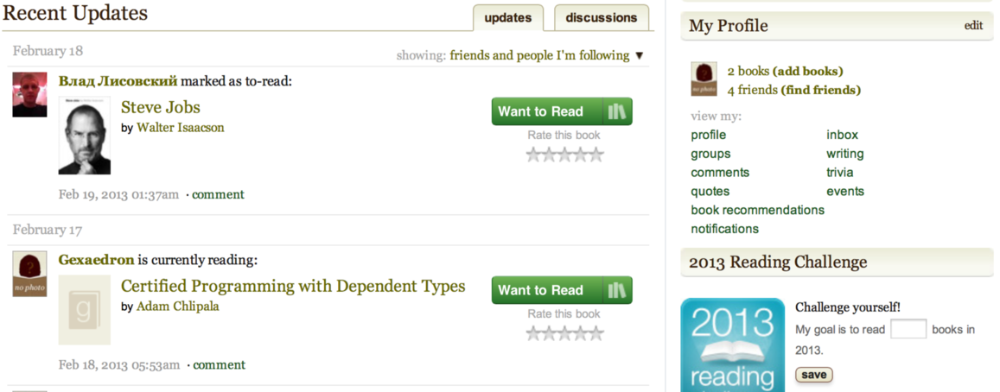

Lab 1 / part 2
===========

Взяты конкуренты - соц сети, онлайн библиотеки, компьютерные библиотеки

### [libgen.info](http://libgen.info)

Проблема этой замечательной библиотеки в медленной скорости работы(т.к. большая коллекция), невозможности оценить контент до перехода на страницу и сложности в том чтобы подобрать книгу конкретного формата в силу дублирования карточек.

### [Traum Library](http://traumlibrary.net/lgru.html)

Библиотека Траума - это локальная библиотека, появившаяся на Рутрекере в 2008 году путем объединения архива Либрусека c одной из существовавших в то время сборок aldebaran + fictionbook + fenzin. В дальнейшем были обработаны все доступные на трекере сборки и архивы fb2 книг и отслеживались обновления всех основных fb2-библиотек в сети.
Вероятно, являлась наиболее полным (на дату последнего обновления) структурированным собранием доступных в сети fb2-книг на русском и английском языках.
\* В библиотеке версии 2.32 - 188.505 книг общим объемом 139.6 Gb.

### [http://lib.ru](http://lib.ru)

- _ первая российская библиотека
- _ шустрая, аккуратно сделана
- _ позволяет читать в разных форматах

### [http://ofps.oreilly.com](http://ofps.oreilly.com)

Крутой рендер html! Выложены лишь некоторые книги издательства.

### [http://hackershelf.com/browse/](http://hackershelf.com/browse/) 

прекрасные подбоки it-книг, доступных для чтения онлайн

### [http://www.flibusta.net/b/68377/read](http://www.flibusta.net/b/68377/read) 

- _ Клон lib.rus.ec
- _ настоящая народная библиотека
- _ возможность читать онлайн
- _ слабая поддержка pdf и компьютерной литературы

Рассказывая о FB2-библиотеках, нельзя не упомянуть и
«[Флибусту](http://flibusta.net/)» — независимый книжный ресурс,
появившийся как ответ на введение абонентской платы за пользование
«[Либрусек](http://lib.rus.ec/)». «[Флибуста](http://flibusta.net/)»,
которая поддерживается частью отколовшихся пользователей,
является практически полной его копией: сервис сохраняет тот же внешний
вид и функциональность, а главное — обладает аналогичной базой данных.
Сайт имеет несколько альтернативных вариантов входа (включая доступ
через сеть I2P), поддерживает OPDS-каталог и торрент-трекер.

Главная страница свободной библиотеки «Флибуста»

### LiveLib

[http://www.livelib.ru/book/1000234707](http://www.livelib.ru/book/1000234707) 

Заметки на полях:
- _ нравится что по каждому автору есть библиография, жаль без рейтингов.
- _ “подборки” книг получились невнятными, нет смысла их повторять

[Лучшие книги](http://www.livelib.ru/author/48/top)
[Книги по дате](http://www.livelib.ru/author/48/latest)
[Рецензии](http://www.livelib.ru/author/48/reviews)
[Цитаты](http://www.livelib.ru/author/48/quotes) для автора -- это круто

Проект появился в феврале 2007 года,
именно тогда в их блоге появилась первая запись,
рассказывающая про идею проекта, а уже в марте
[Анатолий Тихомиров](http://lief.ru/)
сотоварищи открыли сеть для публичного тестирования.

Возможность найти рецензии на интересующие вас
книги, и ознакомится с новинками, и возможность создать свою книжную
полку, и определить список “к прочтению…” и интересный книжный форум…а
также море цитат и полезные конкурсы. Вообщем есть где книжному червю
порезвиться :) Все это сдобрено возможностью поиска по тегам и просто
благожелательной атмосферой…

Когда я в первый раз попал на этот сайт, то думал, что и здесь меня
будет ждать очередной сайт в стиле «все как у всех», но по мере того,
как я разбирался с его возможностями, понимал, что в нем есть и
оригинальные идеи.

Разумеется, здесь есть стандартный набор возможностей из друзей, оценок
и рецензий. Книг в базе много, что особенно понравилось, очень много
технических книг и книг по программированию. Причем в базе есть даже не
переведенные на русский язык книги, которые можно заказать через Озон.
LiveLib оказался единственным сайтом подобного типа,
на котором нашлись некоторые книги по программированию.

К каждой книге пользователи могут добавлять метки, по которым можно
искать похожие книги. Разумеется, технических книг на сайте меньше, чем
художественных, поэтому, например, на облако тегов метка
«программирование» не попало, но это не страшно, потому что метки для
поиска можно вводить вручную.

Но дальше начинается самое интересное, от чего поборники копирайта
должны доставать калькуляторы для подсчета своих убытков и сразу же
начинать краснеть от злости. Каждую книгу можно попытаться найти в
электронных библиотеках. А если книгу найти не удалось, то можно
оставить запрос с просьбой закачать эту книгу. Каждый пользователь кроме
того может отмечать в каком виде у него есть та или иная книга — в
бумажном, электронном или в виде аудиокниги. Электронные книги можно
закачивать прямо на сервер LiveLib, в том числе и анонимно. Как только
кто-то закачает электронную книгу, то те, кто жаждет ее скачать сразу
это увидят. Очень полезная штука.

Оцениваются книги по трехбальной шкале: понравилось, средне и не
понравилось. К сожалению, при добавлении книги в список прочитанных
нужно обязательно указывать дату, когда ее прочитал, а список
прочитанных книг сортируется по дате прочтения.

А еще можно оценивать и рецензии по принципу согласен-несогласен, тоже
неплохая возможность. И еще можно давать ссылку на рецензии на своем
сайте.

Кроме списков «Читал» и «Хочу прочитать» есть список «Сейчас читаю».

LiveLib обладает, наверное, самой большой пользовательской базой и
постоянно ее увеличивает.
Вообще, это, вроде бы, единственный проект у которого есть инвестор.

### Calibre 

#### Управление библиотекой и универсальный конвертер электронных книг 

Так как являюсь большим поклонником чтения, то в какой момент взор мой
упал на электронные книги. Преимущества были для меня налицо. Особенно с
частыми командировками. Вес, размер, удобство, ну и цена электронных
версий книг (предпочитаю честную покупку текстов). Попользовавшись
несколькими экземплярами остановился на Sony PRS-505. Сначала смутил
формат lrf, но выход был быстро найден — онлайн-конвертеры fb2 в lrf.
Онлайн — потому что являюсь пользователем Linux и дома и на работе, плюс
дома для игр использую WinXP. В общем полный разброд. Но когда начал
искать книги на английском, то наткнулся на кучу других форматов от pdf
до epub и еще более экзотические варианты. Плюс книг на компах стало
много и разбираться в них стало трудновато (я не единственный
пользователь еКниги в семье). В общем назрела необходимость в каком то
управлении этим хаосом и удобным конвертированием форматов, плюс
нативная поддержка Linux. В одном из комментов на Хабре увидел
упоминание про Calibre. Скачал, поставил — понравилось. Теперь пользуюсь
полностью ей. Поэтому хотелось бы сделать краткий обзор данной
программы.

Далее пользоваться ей сплошное удовольствие. Очень понравилась
конвертация книг в нужный мне формат и скачивание информации о книги по
ISBN. Часть книг у меня были в fb2 и там была уже кой какие описания
книг. Немножко привел это в порядок и проверив серии книг и единство
написания имен авторов, я подключил свой ридер Сони и указал закинуть
все книги на карту ридера. Calibre сама cконвертировала все книги в lrf
и аккуратно положила их на карту памяти ридера.

Также очень понравился встроенный сервер контента. На работе комп
постоянно включен в инет и имеет белый адрес, то основная библиотека у
меня стала там. Удобно тем что книги я качаю все на работе и закидываю в
единую библиотеку. Если ридер с собой то сразу синхронизирую. Или
скачиваю дома уже со своей библиотеки и синхронизирую с домашней
библиотекой. Но самое удобное когда уедешь куда то в город или в
командировку и забудешь ридер, то можно залезть с телефона и скачать
нужную тебе книгу дочитать хоть на мобильном. Или удобно поделиться
книгой с другом.

Для книг на английском все метаданные и обложку программа находит на ура,
с русскими сложней. Функцию скачивания новостей глубоко не
тестировал за особой ненадобностью. Но на первый взгляд достаточно
удобно.

#### Вывод

Начав искать конвертер форматов книг для Linux я в итоге нашел себе
отличный менеджер библиотеки который теперь использую на всех своих
компах под разными ОС и наконец то привел в порядок свою библиотеку.
Крупных багов замечено не было и нареканий программа не вызывает.
Поэтому хотелось бы выразить благодарность ее создателю Kovid Goyal и
порекомендовать всем владельцам электронных книг и поклонникам чтения.

Начав работать с данным менеджером библиотеки, первым делом закинул туда
всю свою коллекцию. Это не заняло много времени, так как все лежало в
одной папке, в которой было что то похожее на порядок, но не идеальный.
Выбрав добавление всех книг из данной папки Calibre просканировала ее
содержимое и перенесло в свою библиотеку рассортировав все аккуратно по
папочкам.

[Goodreads — социальная сеть любителей чтения](http://www.goodreads.com) 
-----------------------------------------------------------------------------------

- _ Симпатичный сайт
- _ Имееет интеграцию с facebook, друзья пользуются.
- _ Ничего не понятно, т.к. ориентация на людей а не на книги.
- _ Не дает загружать, читать или скачивать книги.

### Что есть Goodreads? 

The goal of Goodreads is to find good reads, those books that leave you
satisfied and/or wanting more. It is also about avoiding bad reads,
which are books that aren't worth the paper they are printed on.

As a book-lovers social network, Goodreads allows you to build a list of
books, rate and review those books, and find out what your friends are reading.

Founded in 2006, Goodreads is one of the most popular book-based social networks.

### Why Should I Use Goodreads? 

Authors, writers and book lovers will enjoy belonging to this social
network devoted to the art of reading. Goodreads lets you share books
with friends, find out more information about a book or author, and
connect with people who have similar interests.

### местные рассылки по e-mail 

Я бы назвал этот сервис как «клуб книголюбов» в возможностью
расшаривания книг своим друзьям. Глядя на этот дизайн, можно смело
сказать «минимализм — это круто!». Так же — это одна из очень немногих
качественных рассылок, которая позволяет себе вставить целых 2 банера,
но учитывая их высокий таргетинг, не считаю это минусом. Так же я привел
лишь часть рассылки, ибо на самом деле она раза в три длиннее, чем на
скрине, но общий вид я передал.

\*взято из статьи lifehacker.ru 2011 года

Goodreads, которую можно назвать «Facebook для книголюбов», заслуживает
более внимательного рассмотрения на страницах «Лайфхакера».
 

### Книжные веб-сервисы как навигаторы для поиска книг и собеседников 

Для чтения таких книг требуется много времени и сил, поэтому не стоит
тратить часы на поглощение второсортной литературы — время имеет слишком
высокую ценность. Благодаря современным технологиям, мы не выходя
из дома можем получить доступ к миллионам оцифрованных книг и выбрать
лучшие книги, релевантные нашим жизненным и профессиональным целям.
Найти ориентиры в бесконечном многообразии литературы и определить,
какая книга окажется следующей у нас в руках, — трудная задача.

Сделав этот сложный выбор, мы сталкиваемся с вызовом нашему интеллекту
и терпению — нужно прочесть книгу эффективно, вдумчиво, принять все, что
она может нам дать. Одним из условий глубокого понимания книги является
обмен отзывами и мнениями с другими читателями, обсуждение книги
с интересными собеседниками. Дискуссии о прочитанных книгах рождают
новые идеи, развивают мышление и речь, учат уважать собеседников
в споре и, как следствие, достигать взаимопонимания с окружающими
людьми.

Книжные веб-сервисы и социальные сети помогают нам выполнять эти задачи:
выбирать книги для чтения на основе рекомендаций от знатоков хорошей
литературы и находить собеседников для обсуждения прочитанных книг.

### Визуальный тур по Goodreads 

Социальная сеть Goodreads позволяет вести виртуальную картотеку
прочитанных, читаемых в данный момент и отложенных к прочтению книг,
обмениваться рекомендациями с друзьями и представляет собой целостную
экосистему для взаимодействия книголюбов, писателей и издателей.

### Профиль пользователя 

Каждый пользователь Goodreads заполняет свой профиль — подробный портрет читателя.

Книги в профиле располагаются на книжных полках: по умолчанию
предлагаются полки Read («Прочтенные»), Currently-Reading («Читаю
сейчас»), To-Read («К прочтению») и Favorites («Любимые книги»). Однако
допускается создание любого требуемого количества книжных полок —
например, для упорядочения ваших книг по жанрам.

Профиль можно украсить, разместив в верхней его части одну полку
на выбор в виде ряда обложек книг. Остальные полки расположены
на отдельных страницах и отображаются либо в виде списка книг
с информацией о каждой, либо в виде рядов обложек.
 

Книжные полки являются главным элементом профиля пользователя Goodreads.
Однако здесь размещается и другая информация: списки любимых писателей,
жанров и цитат из книг, устройства для чтения, которыми обладает
читатель (букридер, планшет, смартфон и т.п.), список его друзей, лента
обновлений, отображающая действия пользователя на сайте, и прочие
данные.

### Добавление книг на книжные полки 

Для добавления книг на полки их нужно найти в базе Goodreads,
насчитывающей несколько миллионов книг. Поиск осуществляется по названию
книги, по имени автора (выдается список всех книг данного автора) или
по ISBN (International Standard Book Number — международный стандартный
номер книги).

Отыскав нужную книгу, можно ознакомиться с ее профилем. Здесь собрана
подробная информация о книге: аннотация, количество страниц, дата
публикации, наименование издательства, ссылка на список изданий разных
лет, краткая информация об авторе со ссылкой на его полный профиль,
цитаты, видео и т.д., а также отзывы пользователей Goodreads об этой
книге, отзывы ваших друзей и рейтинг книги.

Книга одним щелчком мыши добавляется на любую из полок. При желании
можно заполнить свой обзор: написать отзыв или целую рецензию, поставить
оценку книге (от одной до пяти звездочек), указать даты начала
и завершения чтения, отметить имена друзей, которым вы хотите
порекомендовать эту книгу, указать прогресс чтения (на какой странице
вы находитесь) и т.д.

Книги можно находить в базе не только посредством системы поиска:
в особых разделах Goodreads они упорядочены по жанрам и в виде списков,
создаваемых самими пользователями социальной сети (например, «Лучшие
книги XX века», «Самые ожидаемые книги 2011 года», «Лучшая
постапокалиптическая фантастика», «Лучшие книги с провальными
экранизациями» или наоборот — «Плохие книги с удачными экранизациями»).
Кроме того, пользователям предлагается букмарклет для браузеров,
с помощью которого книги быстро добавляются на полки при просмотре
их на сайте Amazon.com.

Если книгу не удалось найти в базе Goodreads, то ее можно добавить
вручную, указать подробные данные и загрузить изображение обложки.

Есть инструмент импорта книг из файлов в форматах CSV, XLS и TXT или
с любых веб-страниц, на которых присутствуют номера ISBN. В дальнейшем
книги могут быть экспортированы в виде файла CSV.

Лента друзей и другие социальные связи между пользователями

Когда вы отмечаете книгу как прочитанную, читаемую в данный момент или
отложенную к прочтению, публикуете отзыв о книге, ваши друзья видят эти
действия, могут их комментировать и добавлять упоминаемые вами книги
на свои книжные полки. Удобно, что фильтрация ленты легко настраивается,
поэтому вы будете видеть только те обновления друзей, которые вам
интересны.

Социальные связи между пользователями Goodreads этим не ограничиваются.
Есть возможность рекомендовать книги своим друзьям, обмениваться
сообщениями по внутренней почте и вступать в группы по интересам для
обсуждения книг, произвольных тем, участия в опросах.

В Goodreads есть социальная иерархия: пользователи, разместившие в своем
профиле более 50 книг, имеют право стать библиотекарями. Обладатели
этого статуса могут редактировать данные о книгах и авторах, объединять
в списки разные издания одной и той же книги, пополнять каталог
электронных устройств для чтения (обычные пользователи тоже могут,
но при этом требуется модерация нового устройства библиотекарями).

### Интеграция с веб-сервисами, социальными сетями и блогами 

Goodreads интегрируется с другими веб-сервисами и социальными сетями —
обновления вашей ленты при этом публикуются в Twitter и Facebook,
а также в MySpace, Windows Live и FriendFeed.

Данные Goodreads передаются во внешний мир также посредством тонко
настраиваемых виджетов для блогов с информацией о ваших книгах на разных
полках.

### Литературные викторины 

Желающие испытать свою читательскую эрудицию участвуют в викторинах,
состоящих из вопросов о книгах и писателях с вариантами ответов.
Викторины можно создавать самостоятельно и привлекать к игре в них ваших
друзей и других пользователей.

 

### Goodreads на мобильных устройствах

Goodreads доступна в виде мобильной версии сайта и клиентов для iPhone и Android.

Хорошая новость есть не только для обладателей смартфонов, но и для тех,
кто читает книги на букридерах Amazon Kindle: можно синхронизировать
данные о книгах, которые вы прочли и читаете сейчас, и цитаты из книг
между вашими аккаунтами Kindle и Goodreads.

### Заключение 

В Goodreads царит атмосфера любви к книгам и принадлежности
к глобальному объединению читателей. Благодаря продуманному интерфейсу,
каждый настоящий книголюб чувствует себя здесь как дома и имеет
возможность исследовать волшебный мир литературы, ежедневно пополняя
свою картотеку новыми достойными книгами.

Количество русскоязычных пользователей в Goodreads пока невелико.

Мы выбрали эту социальную сеть для ведения хронологии чтения, поиска
новых книг и обмена отзывами друг с другом, однако существуют и другие
удобные инструменты выполнения перечисленных задач. Этой статьей
мы открываем цикл обзоров таких веб-сервисов и социальных сетей.

Надеюсь, что все больше людей будут осознавать важность чтения книг для
получения уникальных знаний, заполнения пробелов в образовании
и обретения подлинной свободы дисциплинированного разума, о которой
писал американский философ Мортимер Адлер в книге
«[Как читать книги](http://lifehacker.ru/2011/03/23/recenzija-mortimer-adler-%C2%ABkak-chitat-knigi%C2%BB/)».

Те, кто
[правильно читает хорошие книги](http://www.pavelkalugin.ru/2011/04/blog-post_25.html),
— видят мир иначе, проникают глубже в суть происходящего вокруг, обладают
надежной защитой от манипуляций в условиях постоянных информационных
войн и разрушают все преграды на своем пути к профессиональному
и духовному самосовершенствованию.
 

### Комментарии экспертов по чтению

[Петр Диденко](http://www.kip.ru/), в прошлом веб-евангелист Microsoft,
ныне главный специалист по стратегическому развитию компании «СКБ
Контур», которая является одним из крупнейших разработчиков программного
обеспечения в России и крупнейшим поставщиком SaaS-услуг:

«Идей хороших, нужных и полезных сервисов всегда было мало. Очевидно,
идея соцсети вокруг книг тоже далеко не нова и если бы мне сказали о
таком стартапе, скорее всего я был бы настроен заочно скептически.
Однако, часто хорошая реализация старой идеи «взлетает» к небесам —
[посмотрите](http://www.kip.ru/realtime/2011/02/%D0%B2%D0%B5%D0%BB%D0%B8%D0%BA%D0%BE%D0%B5-%D0%BA%D0%BE%D0%BC%D0%B1%D0%B8%D0%BD%D0%B8%D1%80%D0%BE%D0%B2%D0%B0%D0%BD%D0%B8%D0%B5.html)
хотя бы на iTunes. Когда я думаю о книгах, о сотнях миллионов
существующих в мире книг, иногда становится страшно. Страшно от такого
количества знаний, которые я не знаю и страшно что-нибудь пропустить.
Goodreads помогает бороться с этими страхами ;-)».

[Виктор Захарченко](http://about.me/zaha), исполнительный директор
компании-разработчика социальных игр Drimmi, создатель и руководитель
различных интернет-проектов, постоянный эксперт в программе «Точка» на
радио «Эхо Москвы» (вместе с Александром Плющевым):

«Я «вернулся» к активному чтению с появлением у меня iPad. Столкнулся с
проблемой: с чего начать, как правильно составить роадмап, ведь
упоминания интересных книг в Twitter, Facebook и Friendfeed шли
непрерывным потоком. Попробовал разные сервисы — Bibla Ярослава
Грешилова порадовала своей простотой, к разработке LiveLib я в свое
время даже имел некоторое отношение, а вот «ИМХОнет» сразу не
понравился. Я искренне уважаю все то, что делает Александр Долгин, но
сам сервис мне показался не очень «дружелюбным» — тем более, что пару
моих запросов на рекомендации, основанных на очень популярных книгах,
выдали нулевой результат.

Ссылку на Goodreads встретил в одной из френд-лент. Кажется, у Славы
Баранского. Года три назад идею такого сервиса мне описывал Костя
Бочарский («Секрет фирмы»): опираться нужно не на алгоритмы, а на
авторитетность рекомендаторов. Костя хотел освещать выбор
бизнес-лидеров. В Goodreads я смотрю на выбор тех людей, чьи взгляды на
идеи self management и project management считаю сходными со своими.
Стоит подписаться на 5-6 «правильных» персоналий — и ни одна толковая
новинка не пройдет мимо тебя. К тому же, можно «поймать» напоминание о
том, что неплохо бы перечитать «1984″.

Использую сервис и для учета своей библиотеки. Именно здесь, а не на
Amazon, веду свой реальный вишлист книг. Правда, еще дублирую его
«Корзиной» на OZON.

Единственное, что немного расстраивает в Goodreads: глубоко спрятанный
сервис информирования о новинках месяца».

Итоги исследования
------------------

Проблема всех сервисов в диверсификации предметной области - 
одни дают людям общаться и рассказывать о книгах, другие
предлагают купить книгу, третьи - скачать неудобный формат и посмотреть рекламу,
четвертые - вести коллекцию на жестком диске.

Я же хочу сохранить коллекцию в облаке и иметь доступ с любых устройств :)

### Какие решения есть у конкурентов?

#### Расположения книг:

плоский список - позволяет охватить разом большой объем информации

список со снипетами - позволяет сэкономить множество кликов при выборе

галерея обложек - дает мало информации, но дает интуитивное представление о книге

двухколоночная верстка - пытается вместить много информации на 1 экране,
вопрос удобства выбора остается открыт

#### Катологизация:

древовидная иерархия жанров - компьютерные книги сложно соотнести с 1 категорией

рейтинги - позволяют отсеять низкосортные произведения, но плохо помогают в выборе

отзывы - полезны, когда есть сортировка по числу лайков.
позволяют оценить человека, который его оставил (sarcasm)

полки и тэги - возможность пользователям самим управлять коллекцией

список авторов - позапрошлый век

Сформулировать проблему, что можно улучшить
-------------------------------------------

Проблема в отсутствии интеграции.

ла-ла

Постановка задчи
----------------
 

Решено сделать электронную библиотеку, которая свободна от сложившихся
стереотипов(предрассудков) и служит одной цели -- чтение с максимальным
комфортом.

Компьютерная литература имеет свою специфику. Тяжело решаемой проблемы
формул, pdf и особенно djvu. Помимо этого чтение обычно происходит по
главам с частым обращением к содержанию.

Часть функционала стоит взять у конкурентов, т.к. есть готовые
реализации среди которых мы выберем лучшие.

Так как внедрение функционала требует больших трудовложений,
проект предполагается выполнять придерживаясь минимализма и простоты.

В проектировании разумно ориентироваться на уже имеющиеся технологии,
нет смысла в развитии. Если бы существовала серебряная пуля - ее купили бы конкуренты.

