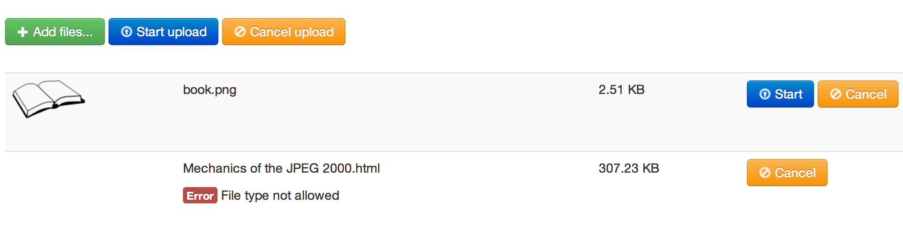
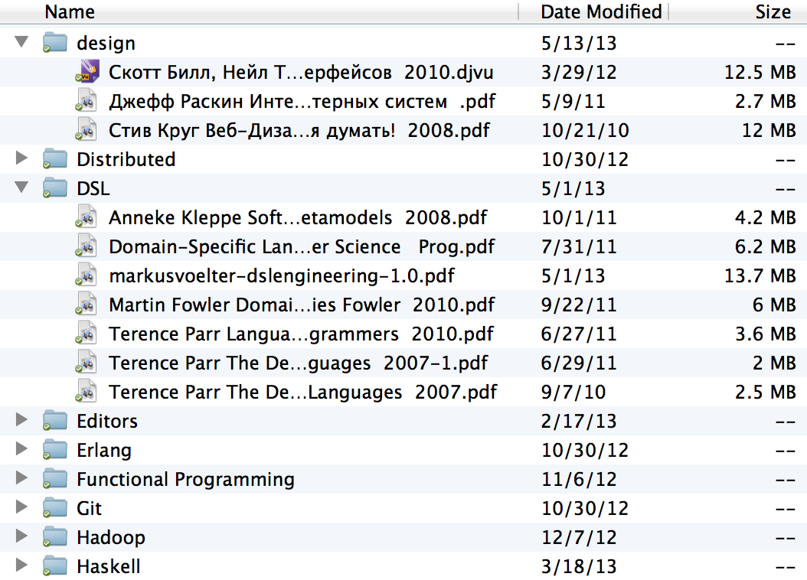
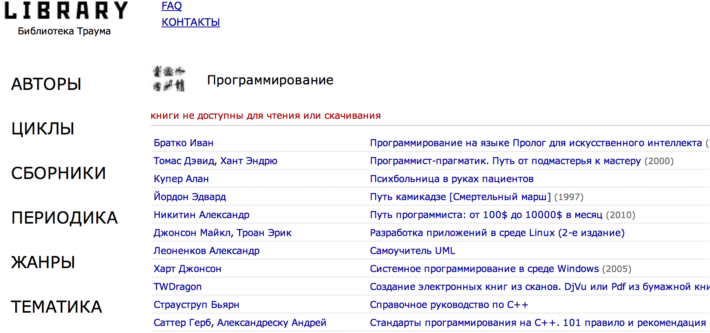
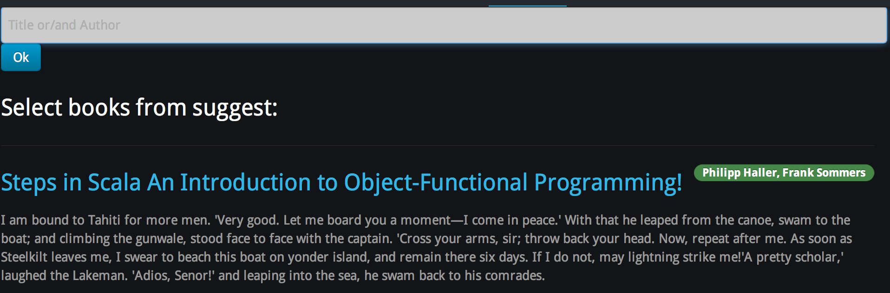

Lab4
====

### Задача:

Проектирование персон, сценариев, информационной архитектуры,
компоновка и лэйаут страниц

### Цель:

Спроектировать интерфейс, решающий задачу.

Представить людей, использующих программу, о чем они думают, чего хотят.
Достичь эмпатии данным персонажам и соответствующе структуризировать интерфейс.

Пользователи
------------

В первую очередь предполагается дистрибуция в кругу друзей, поэтому
сервис должен быть ориентирован на продвинутых пользователей.

Книги читать будут:
- _ На компьютере, планшете, читалке и телефоне 
- _ В браузере на любых устройствах 
- _ В специальных программах для чтения iBooks, Kindle
- _ На электронных читалках kindle4 и аналогах

### Обычный пользователь Ренат - студент ШАД Яндекс.

Я читаю с мобилки, книжки отмечаю на goodreads, качаю с гугла и lib.ru.

У меня нет дропбокса, я вообще не доверяю облаку ничего важного.

Разбиение на главы только для кулинарной книги пригодится, ну еще для справочников вроде кормена) лол.

Индекс, ранжирование, скачать бесплатно без смс... ну вот не знаю, чем
это лучше того же гугла который по словам учитывает частоту, авторитет,
популярность.

Книги храню в папочке "художественная литература",
а технический - в папке "техническая литература"

Форматах txt, pdf и djvu и это большей частью пиратские сканы или общественное достояние

А зачем категории? у меня все по папочкам раскладывается по мере поступления

аннотации? упаси б-же читать мнение каких-то чудиков)

няшный интерфейс к моим книжкам ты не сделаешь. ты не поставишь мне
новые шрифты латеха на скан фихтенгольца 1976 года издания.

Я вообще не юзаю читалки с функциями "библиотеки" или "аннотациями".
первое не дает мне качать пиратки, второе мне просто не нужно.
 

Ну короче так: книжки, которые я читаю, в нормальном формате, как
правило, платные. поэтому я читаю пиратские сканы, которые на любом
девайсе выглядят как отстой.

Результат -- сервис ему не нужен, если он не будет напоминать Гугл
 

### Продвинутый пользователь Николай

Первым делом хочет добавить свои книги в коллекцию, вплоть до того что
запускать проект локально на своем компьютере. Имеет аккаунт дропбокс и
готов делиться URL

При появлении новой технологии ищет всю возможную информацию по ней(в
том числе блоги и добавляет себе в коллекцию).

Затем попадает в соответствующий раздел(полку) и ищет информацию,
например вбивает термин и смотрит в какой главе какой книги он чаще
встечается.

Найдя книгу или главу смотрит текст чтобы понять в каком стиле пишет
автор и для какого уровня знаний.

Понравившуюся книгу загружает в Kindle/iphone... попадая на настройки
если не заданы параметры интеграции.

### Типичный программист Виктория

В домашней библиотеке должно быть удобно просматривать свои книги,
выкладывать их и как-то классифицировать по содержанию. Поэтому главное
внимание должно уделяться поиску информации в них и удобному интерфейсу
для добавления книги. Классификация может быть и не автоматической, но
должны присутствовать отдельные "полки", т.е. если у меня есть книги про
Python, то нужно как-то их разделять -- те, которые относятся к
разработкам Gui, те, которые относятся к Twisted или другим фреймворкам,
те которые относятся к веб-программированию и т.д.

Быстрое добавление лучше всего сделать с помощью drag-and-drop. Поиск
должен быть как общий, так и по отдельным книгам. Предполагается, что
это будет сайт с домашней библиотекой, который могут видеть и другие
люди. Люди любят болтать с другими людьми и делиться общими интересами
(в данном случае книгами), поэтому должна быть возможность группировать
друзей по книгам и просматривать книги друзей.

Просмотр -- тоже важная часть использования. Просмотр лучше осуществлять
постранично, при этом на одном "листе" должно быть не менее 250
текстовых строк, но в тоже время всю книгу разом пролистывать неудобно.
Необходимо добавить закладки и пометки и быстрое их открытие. Они должны
быть представлены где-то на "полях": в виде галочки либо глаза.

Дизайн сайта должен быть строгим, никаких розово-голубых "рюшечек",
которые так и отвлекают от чтения любимых книг.

В самом начале книги должно быть название, краткое содержание, а также
возможность скачать книгу на мобильное устройство, либо на компьютер в
различных форматах (pdf, epub, и т.д.) и конвертация в какие-либо
форматы. Удобно было бы закинуть книгу в формате pdf (если она конечно
не отсканированная), а получить в epub или другом формате удобном для
чтения на мобильных устройствах.

В момент прочтения любой книги хочется видеть содержание, поэтому оно
также должно присутстовать где-то на "полях" сбоку. По-мимо конвертации
и качестсвенного просмотра, было бы полезным пользоваться библиотекой с
любого устройства, даже когда нет рядом своего собственного. Поэтому
можно сделать синхронизацию с dropbox и запись самых интересных книг,
либо тех, которые сейчас читает пользователь, в dropbox. Аутентификацию
тоже лучше проводить по dropbox'у, чтобы пользователь не задумывался о
самостоятельной "перекачке" книг из одного устройства в другое.

Кто будет пользоваться байтом с домашней библиотекой?

Люди, которые знают, какие книги им интересны, которые любят читать и
оставлять множество заметок.

Люди, которые хотят, чтобы их книги были доступны с любого устройства.  

### Silly Daf - пользователь социальной сети Live Lib

Для меня нет принципиальной разницы в каком формате книга. Но платить я
буду лишь за бумажные. Не понимаю, как можно платить за электронную
художественную литературу(именно за нее, ибо к профессиональной
литературе другой подход. Это больше для знаний и какого-то опыта)? Для
меня книги - это некая реликвия. которая переходит из поколения в
поколение. Своим детям я подарю CD диски с книгами? нееет. Так что книги
качаю на бесплатных ресурсах и те, которые на данный момент не могу
приобрести, не нашла или срочкно хочу прочитать, а времени на покупку
нет. В другое время предпочитаю выбирать их в книжных магазинах, чтоб
потом ставить на полочки дома)

конечно, все понятно, что книжная индустрия крайне невыгодня в наше
время - время электронных книг и романов txt формата. Но отказываться от
бумажных книг не могу, не смогу и не буду. Как-то у моих родителей книги
поместились в домашней библиотеке (за что я им очень благодарна) и у
меня получатся. Есть такие произведения, которые, я считаю, иметь в
бумажном варианте просто необходимо. Да и детям я хотела бы в будущем
читать книжки с картинками, перелистывая страницы не с помощью сенсора и
мыши компьютера) вот такая я "старая" романтичная барышня :D

### Итог

Половина пользователей настроено негативно,
сервис должен быть простым и решать насущные проблемы иначе им не станут пользоваться

Сценарий(по шагам)
------------------

### Новый пользователь web сервиса

#### Попадаем на сервис
+ _ попадаем во вкладку About чтобы оценить возможности
+ _ смотрим пример книги из стандартного набора

#### Создааем в пустую коллекцию - нужен импорт книги
+ _ с жесткого диска
+ _ из коллекции на файловой системе
+ _ из существующих библиотек:

#### Поиск нужной книги
+ _ пользуемся категориями
+ _ вбиваем запрос в строку поиска
+ _ отмечаем тэги для фильтрации содержимого
+ _ скачиваем понравившуюся книгу себе на устройство
+ _ переходим к чтению в интерфейсе

#### Переход к чтению
+ _ просмотр оглавления
+ _ поиск особенной книги в главном меню
+ _ чтение с разбиением по главам

#### Редактирование информации
+ _ изменение параметров в личной коллекции
+ _ изменение книги и экспорт настроек
+ _ создание новых тэгов и категорий

#### Просмотр статистики
+ _ оценка прочитанного
+ _ поиск новой книги по интересам

### Пользователь со своей коллекцией книг

+ _ добавить новую книгу
+ _ найти в коллекциии со сложным критерием отбора, в том числе по главам
+ _ продолжить чтение там где остановился

Структура экранов:
------------------

принцип -- каждой функции свой экран

явная внешняя логика сайта, неявные внутренности приложения

“сделай то, не знаю что”

### Меню навигации
\* представлено на всех страницах

+ _ Логотип - ссылка на главную 
+ _ Лента пользователя(полка -- избранное/последнее)
+ _ Библиотека сайта
+ _ Продолжить чтение
+ _ Поиск по книгам + расширенный (возможно на главной странице)
+ _ Импорт книги(возожно на странице пользователя)

### Главная страница, новый пользователь

Сверху горизонтальное меню навигации

Вид библиотеки свободных книг по категориям

На месте списка приветствие с объяснением основных концептов
 

### Страница пользователя (доступна по прямой ссылке)

Список отобранных книг с метаинформацией по ним(как лента)

Поиск по категориям в личной коллекции

### Режим чтения

+ _ удобный контейнер для отображения текста по главам
+ _ быстрый доступ к содержанию (стрелка сбоку для переходов)
+ _ настройки отображения(в том числе дневной/ночной режимы)

### Add new book

+ _ с жесткого диска

+ _ из коллекции на файловой системе (import_book.py)

+ _ из существующих библиотек:

\* вид на сайте создателя

\* вид на нашем сайте

### Карточка книги

+ _ обложка
+ _ описание с амазона
+ _ рецензии и отзывы пользователей
+ _ содержание для быстрого перехода

### Представление по главам

+ _ содержание со сниппетами

### облако тегов в поиске

+ -- to the future

