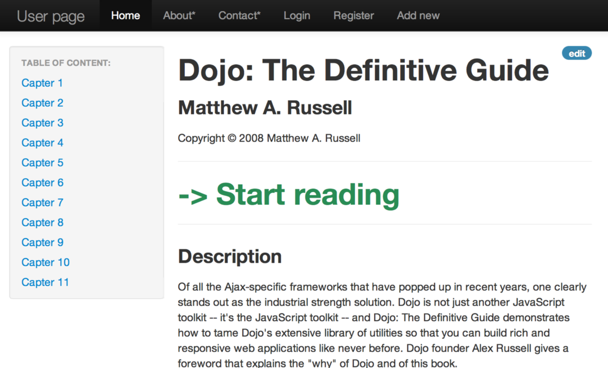
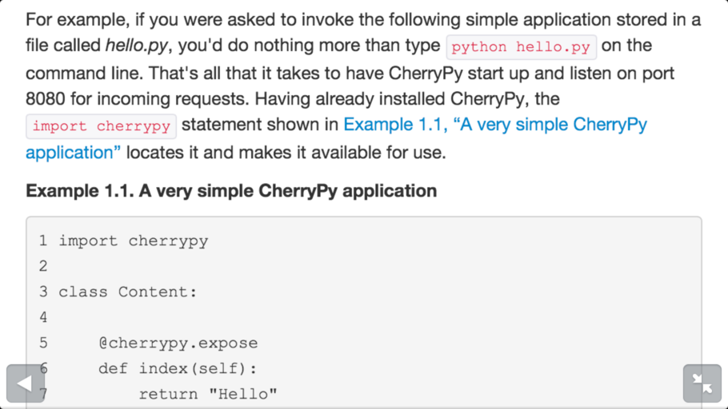

Lab5
====

### Задача:

Спроектировать мобильный и веб интерфейс

### Цель:

Создание интерфейса программы, позволяющего оценить его преимущества и
недостатки, не производя разработку целиком.

Прототип
---------

В качестве хостинга выбран бесплатный проект github Pages, т.к. это
позволяет делиться ссылками с друзьями и использовать мобильную версию с
телефона.

http://spetz911.github.io/bookmine/

### карточка книги:

### Режим чтения с навигацией и поддержкой иллюстраций(десктоп):

### Выделений, ссылок и листингов кода(мобильная версия):

### Мобильная версия получена автоматически
благодаря адаптивному фреймворку Twitter Bootstrap

