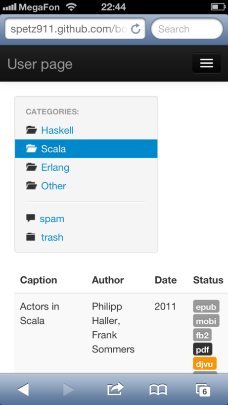

[lab5\_prototype copy](../../2yWOea.html)
=========================================

Oleg Baskakov

Interface Design Report

 

Создание книжной коллекции в интернете {.calibre1}
======================================

Задача: {.calibre2}
-------

Спроектировать мобильный и веб интерфейс

Цель: {.calibre2}
-----

Создание интерфейса программы, позволяющего оценить его преимущества и
недостатки, не производя разработку целиком.

Результат {.calibre2}
---------

В качестве хостинга выбран бесплатный проект github Pages, т.к. это
позволяет делиться ссылками с друзьями и использовать мобильную версию с
телефона.

http://spetz911.github.com/bookmine/

 

карточка книги:

Режим чтения с навигацией и поддержкой иллюстраций(десктоп):

 

Выделений, ссылок и листингов кода(мобильная версия):

Мобильная версия получена автоматически благодаря адаптивному фреймворку
Twitter Bootstrap

 

 

[Table of contents](../../2yWOea.html)
--------------------------------------

-   [Interface Design Report](chapter-1.xhtml)
    -   [Создание книжной коллекции в
        интернете](chapter-1.xhtml#chapter-1-sh1)
    -   [Задача:](chapter-1.xhtml#chapter-1-sh2)
    -   [Цель:](chapter-1.xhtml#chapter-1-sh3)
    -   [Результат](chapter-1.xhtml#chapter-1-sh4)

[previous page](../../2yWOea.html) [start](../../2yWOea.html)

