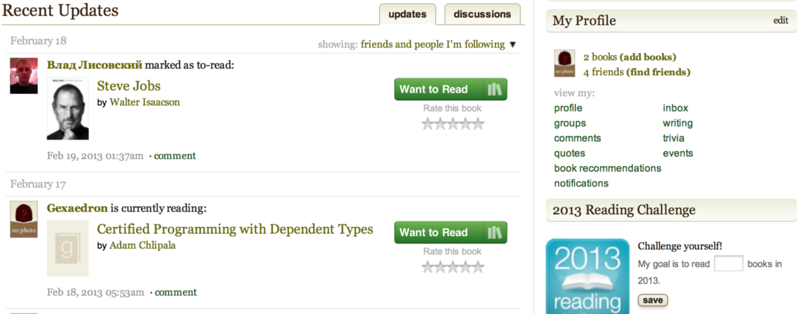

lab6\_results
=============

Oleg Baskakov

Interface Design Report

 

Создание книжной коллекции в интернете
======================================

Результат
=========

http://spetz911.github.com/bookmine/

 

Результатом работы является интерактивный прототип, доступный в
интернете.

Дальнейшим развитием проекта я вижу дать возможность гикам делать fork
проекта в свой репозитарий и направлять JS на свою метаинформацию(чтобы
каждый имел свою коллекцию).

В идеале при добавлении книг должен получаться pull\_request, изменяющий
коллекцию.

Либо локальный скрипт изменения коллекции, результат которого push’ается
в git.

Удалось обойти копира(стов)йтеров -- у каждый свою коллекцию и делится
по необходимости с друзьями.

Решена пробема централизованного сервера(архитектура звезда) и хранения
контента(Dropbox/public).

### Входные форматы:
- AZW4 
- CHM 
- Comic 
- DJVU 
- EPUB 
- FB2 
- HTLZ 
- HTML 
- LIT 
- LRF 
- MOBI 
- ODT 
- PDB 
- PDF 
- PML 
- RB 
- RTF 
- SNB 
- TCR 
- TXT
\* многообразие получается за счет использование Calibre в качестве backend'a
 

 

Выводы
======

Главный вывод -- конкуренты в этой области уже на недостежимой высоте,
так что есть смысл стремиться решить свою конкретную проблему а не
гнаться за мифической аудиторией.

Пока есть [http://www.goodreads.com](http://www.goodreads.com) -- будет
к чему стремиться!

Стало ясно что дизайн начинается когда уже выбран хороший прототип и не
все доходят до финальной стадии.

Нужно ограничить время на исследование предметной области и конкурентов,
выбирая самые показательные примеры.

Процесс дизайна трудоемкий -- не стоит откладывать на последний момент,
иначе можно закопаться в деталях реализации.

 

 

 

[Table of contents](../../7WrRjA.html)
--------------------------------------

-   [Interface Design Report](chapter-1.xhtml)
    -   [Создание книжной коллекции в
        интернете](chapter-1.xhtml#chapter-1-sh1)
    -   [Результат](chapter-1.xhtml#chapter-1-sh2)
    -   [Выводы](chapter-1.xhtml#chapter-1-sh3)

[previous page](../../7WrRjA.html) [start](../../7WrRjA.html)

